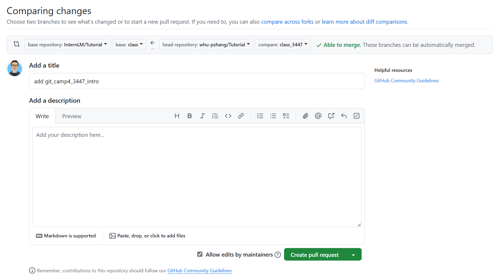
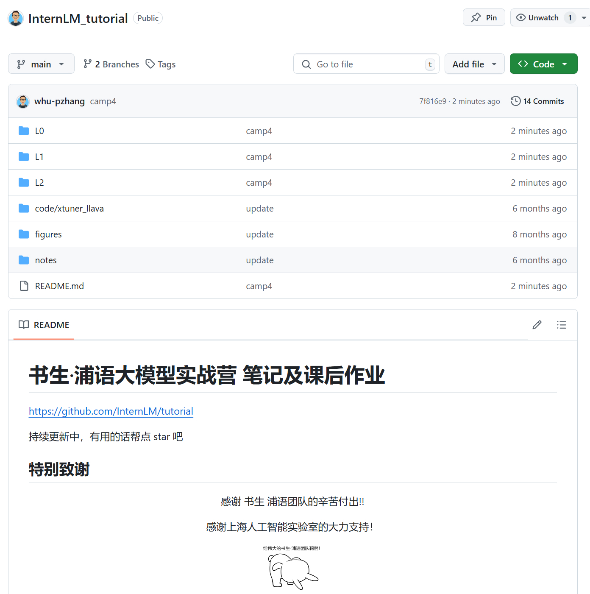

# Git 基础作业

## 任务1：破冰活动，自我介绍


1. 首先在 fork 一份 https://github.com/InternLM/Tutorial/tree/camp4
2. git clone 到本地，并检出 `class` 分支

   ```
   git clone git@github.com:whu-pzhang/Tutorial.git
   cd Tutorial
   git br -a # 查看所有分支
   git co -b class origin/class
   ```
3. 创建分支

   ```
   git co -b class_3447
   ```

4. 创建自己的介绍文件

   ```
    【大家可以叫我】: pzhang
    【坐标】: 武汉
    【专业/职业】: AI工程师
    【兴趣爱好】: 游戏，摄影，电影
    【项目技能】: CV, NLP
    【组队情况】:未组队，快来一起!
    【本课程学习基础】: RAG、LLM
    【本期活动目标】: 了解AI领域的最新技术，掌握AI工程师的基本技能。
   ```

5. 提交修改并推送

   ```
   git add 3447.md
   git ci -m "add git_camp4_3447_intro"
   git push origin class_3447
   ```

6. 网站查看推送分支，点击 `Compare & pull request`， 提交PR至 `class` 分支。




## 任务2：构建个人项目

1. 创建一个 书生大模型实战营的学习笔记项目 `InternLM_Tutorial`



2. 更新本次作业，并提交至远程

   ```
   git add .
   git ci -m "add camp4 notes"
   git push
   ```


