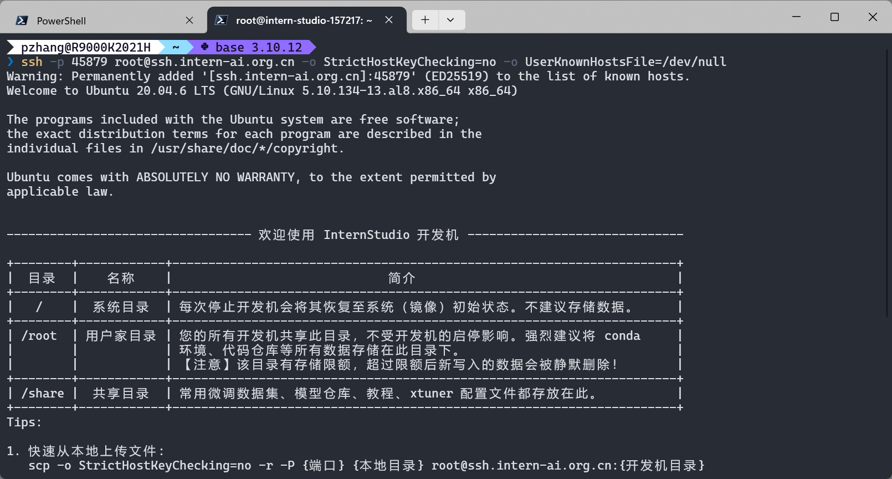
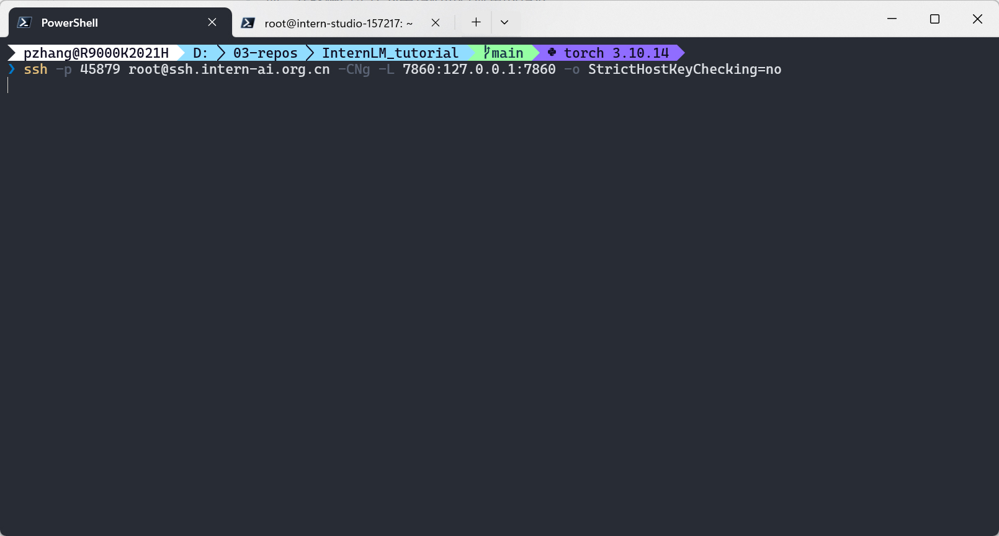
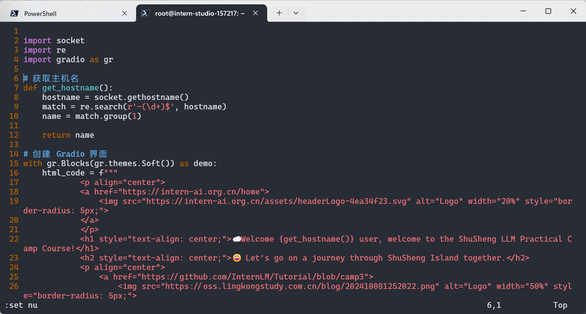

# Linux 基础知识作业

## 完成 SSH 连接和端口映射


创建开发机后，点击 SSH 连接，复制登录命令：




接着配置端口映射。在开发机界面，点击 “自定义服务”，将远端服务器 7860 端口映射到本地。




接着，不要关闭端口映射窗口！
我们在远端服务器上创建  `hello_world.py` 文件。



然后在服务器上运行：

```bash
pip install gradio==4.29.0
python hello_world.py
```

在本地浏览器打开 `http://localhost:7860/`，可以看到 Gradio 界面。


