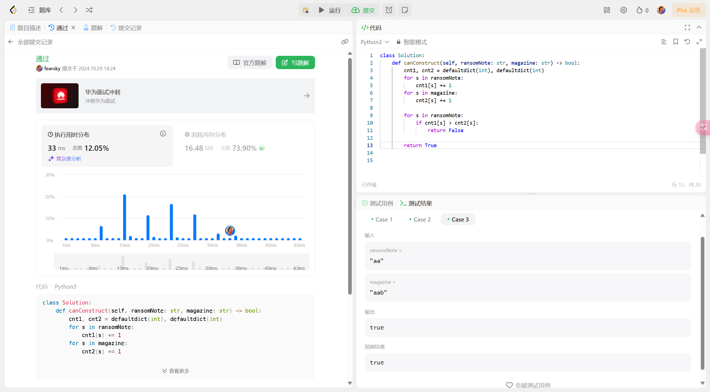
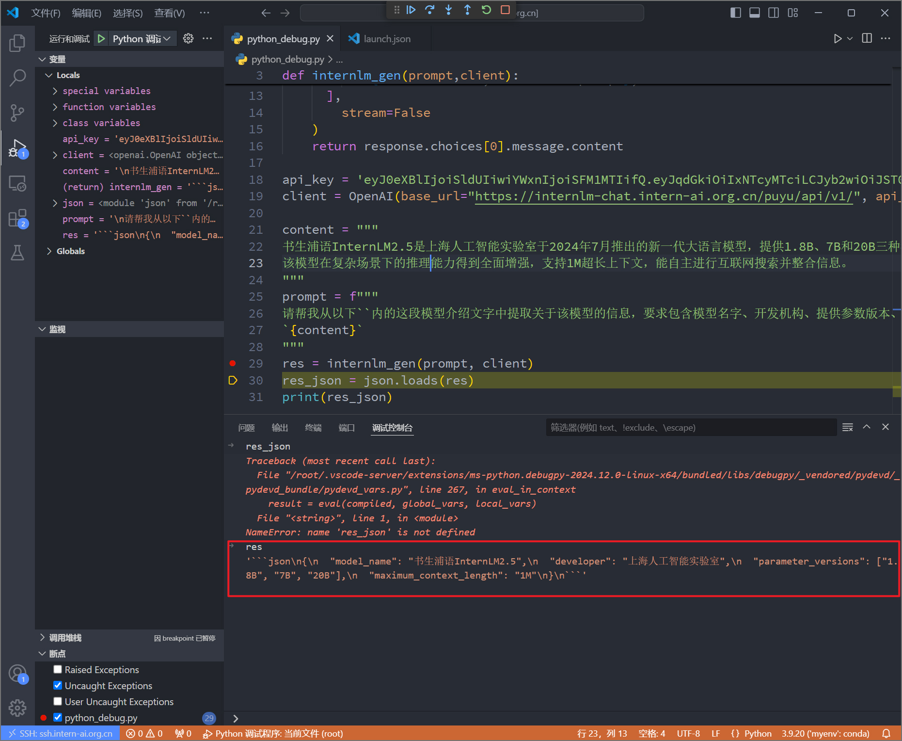

## Python 基础知识

### 任务概览

| 任务类型 | 任务内容                                           | 预计耗时 |
| -------- | -------------------------------------------------- | -------- |
| 闯关任务 | Leetcode 383(笔记中提交代码与leetcode提交通过截图) | 20mins   |
| 闯关任务 | Vscode连接InternStudio debug笔记                   | 10mins   |
| 可选任务 | pip安装到指定目录                                  | 10mins   |


### Leetcode 383 笔记

[383. 赎金信](https://leetcode.cn/problems/ransom-note/description/) 判断一个字符串是否能由另一个字符串构成。

分析发现实际上是一个判断子集的另一种形式。因此通过构建哈希表解决：




### Vscode连接InternStudio debug


远程连接到InternStudio后，在 `root` 目录下创建 `python_debug.py` 文件，输入以下代码：

```python
from openai import OpenAI
import json
def internlm_gen(prompt,client):
    '''
    LLM生成函数
    Param prompt: prompt string
    Param client: OpenAI client 
    '''
    response = client.chat.completions.create(
        model="internlm2.5-latest",
        messages=[
            {"role": "user", "content": prompt},
      ],
        stream=False
    )
    return response.choices[0].message.content

api_key = ''  # 填入你的API key
client = OpenAI(base_url="https://internlm-chat.intern-ai.org.cn/puyu/api/v1/", api_key=api_key)

content = """
书生浦语InternLM2.5是上海人工智能实验室于2024年7月推出的新一代大语言模型，提供1.8B、7B和20B三种参数版本，以适应不同需求。
该模型在复杂场景下的推理能力得到全面增强，支持1M超长上下文，能自主进行互联网搜索并整合信息。
"""
prompt = f"""
请帮我从以下``内的这段模型介绍文字中提取关于该模型的信息，要求包含模型名字、开发机构、提供参数版本、上下文长度四个内容，以json格式返回。
`{content}`
"""
res = internlm_gen(prompt, client)
res_json = json.loads(res)
print(res_json)
```

直接运行报错如下：

```bash
Traceback (most recent call last):
  File "/root/python_debug.py", line 30, in <module>
    res_json = json.loads(res)
  File "/root/.conda/envs/myenv/lib/python3.9/json/__init__.py", line 346, in loads
    return _default_decoder.decode(s)
  File "/root/.conda/envs/myenv/lib/python3.9/json/decoder.py", line 337, in decode
    obj, end = self.raw_decode(s, idx=_w(s, 0).end())
  File "/root/.conda/envs/myenv/lib/python3.9/json/decoder.py", line 355, in raw_decode
    raise JSONDecodeError("Expecting value", s, err.value) from None
json.decoder.JSONDecodeError: Expecting value: line 1 column 1 (char 0)
```

可以看到是 json.loads() 函数报错，原因是返回的结果不是合法的json格式。

因此，我们在 `res = internlm_gen(prompt, client)` 处插入断点，查看返回结果：



可以看到 `res` 结果为：

```
```json\n{\n  "model_name": "书生浦语InternLM2.5",\n  "developer": "上海人工智能实验室",\n  "parameter_versions": ["1.8B", "7B", "20B"],\n  "maximum_context_length": "1M"\n}\n```
```

因此，我们定位到报错原因是InternLM2.5模型返回的结果为markdown标记的的json字符串，而json.loads()函数要求输入的字符串是合法的json格式。因此需要对返回结果进行处理，将其转换为json格式。

可利用正则表达式将markdown 标记移除即可，在 json.loads 前插入以下语句：

```python
res = re.sub(r'```json|```', '', res).strip()
res = re.sub(r"(?<!\")\"(?!\")", '\"', res)  # 处理不正确的引号
```

重新运行，可以得到如下输出：

```bash
{'model_name': '书生浦语InternLM2.5', 'developer': '上海人工智能实验室', 'parameter_versions': ['1.8B', '7B', '20B'], 'max_context_length': 1000000}
```


