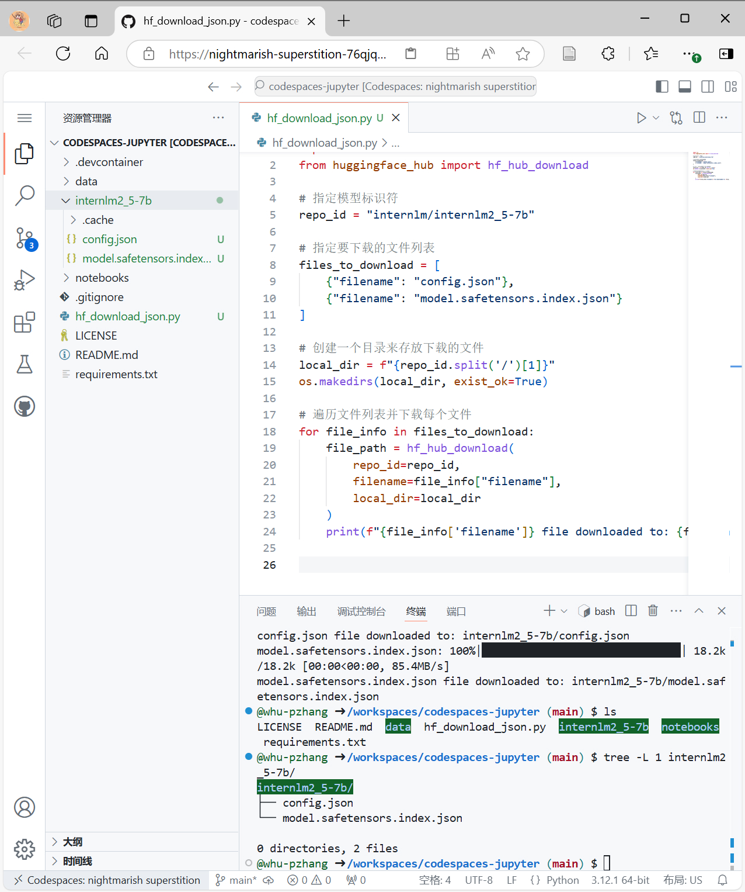
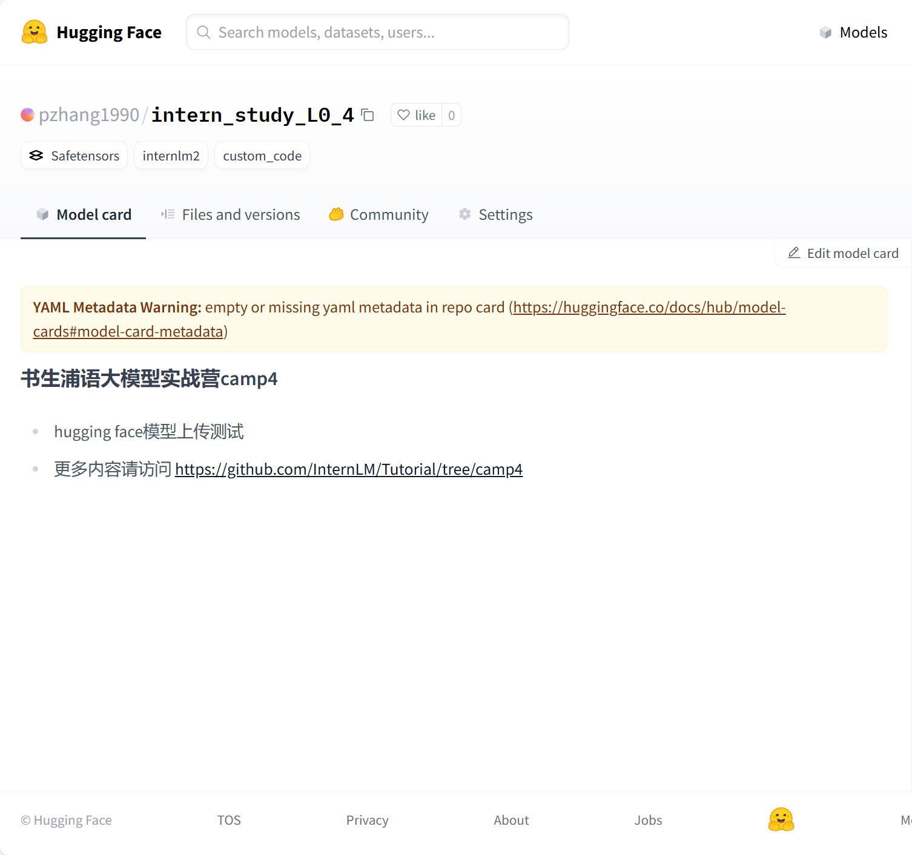
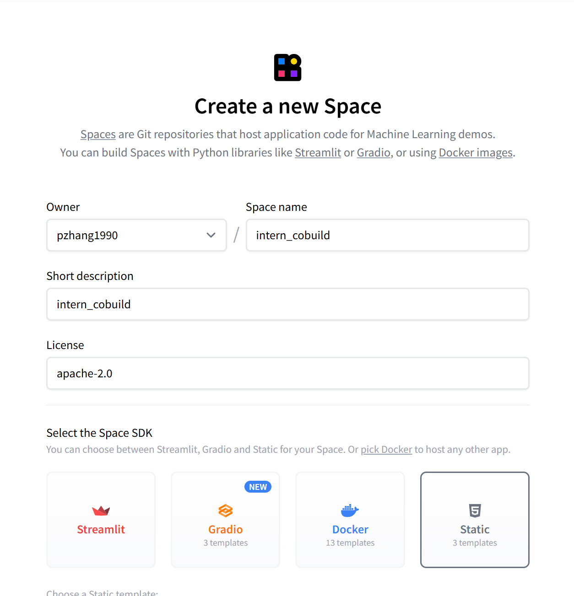
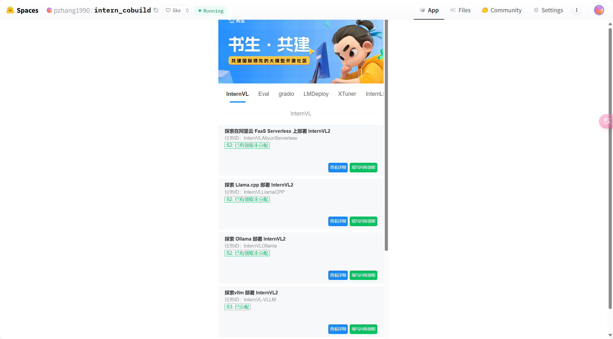

# 书生大模型实战 玩转 HF/魔搭/魔乐社区


## 任务1：模型下载

我们采用 [Github Codespaces](https://github.com/codespaces) 在线环境，从 HuggingFace 上下载模型。

1. 使用 Jupyter Notebook 模板创建环境，安装以下依赖：

```
# 安装transformers
pip install transformers==4.38
pip install sentencepiece==0.1.99
pip install einops==0.8.0
pip install protobuf==5.27.2
pip install accelerate==0.33.0
```

2. 下载 internlm2_5-7b-chat 模型配置文件

在在线环境中创建文件 `hf_download_json.py`, 并写入以下代码：

```python
import os
from huggingface_hub import hf_hub_download

# 指定模型标识符
repo_id = "internlm/internlm2_5-7b"

# 指定要下载的文件列表
files_to_download = [
    {"filename": "config.json"},
    {"filename": "model.safetensors.index.json"}
]

# 创建一个目录来存放下载的文件
local_dir = f"{repo_id.split('/')[1]}"
os.makedirs(local_dir, exist_ok=True)

# 遍历文件列表并下载每个文件
for file_info in files_to_download:
    file_path = hf_hub_download(
        repo_id=repo_id,
        filename=file_info["filename"],
        local_dir=local_dir
    )
    print(f"{file_info['filename']} file downloaded to: {file_path}")

```

3. 运行 `hf_download_json.py` 脚本，下载模型配置文件。

```
python hf_download_json.py
```

得到下载文件目录如下：

```
internlm2_5-7b/
├── config.json
└── model.safetensors.index.json
```




## 任务2：模型上传

还是采用 Github Codespaces 在线环境，将模型上传到 HuggingFace 仓库。

1. 命令行登录
```
huggingface-cli login # 输入 Write 类型的 Access Token
```

2. 创建模型仓库并clone到本地
```
huggingface-cli repo create intern_study_L0_4 

git clone https://huggingface.co/pzhang1990/intern_study_L0_4
```


3. 将模型保存至仓库

这里直接使用刚才下载的 internlm2_5 的配置文件

```
cp internlm2_5-7b/* intern_study_L0_4/
```

创建 `README.md`

```
# 书生浦语大模型实战营camp4

- hugging face模型上传测试
- 更多内容请访问 https://github.com/InternLM/Tutorial/tree/camp4

```

提交至远程仓库

```
cd intern_study_L0_4
git add .
git commit -m "add:intern_study_L0_4"
git push
```




## 任务3：HF Space 上传


1. 创建 Space

    打开 https://huggingface.co/spaces 页面，点击 `Create new Space`，



2. 填写内容

回到 Github Codespaces 页面，将刚创建的 space 克隆至本地

```
git clone https://huggingface.co/spaces/pzhang1990/intern_cobuild

cd intern_cobuild/

```

在 `index.html` 中填入以下内容：

```html
<!doctype html>
<html>
<head>
  <meta charset="utf-8" />
  <meta name="viewport" content="width=device-width" />
  <title>My static Space</title>
  <style>
    html, body {
      margin: 0;
      padding: 0;
      height: 100%;
    }
    body {
      display: flex;
      justify-content: center;
      align-items: center;
    }
    iframe {
      width: 430px;
      height: 932px;
      border: none;
    }
  </style>
</head>
<body>
  <iframe src="https://colearn.intern-ai.org.cn/cobuild" title="description"></iframe>
</body>
</html>

```

3. 推送至远程

```
git add .
git commit -m "update: colearn page"
git push
```



