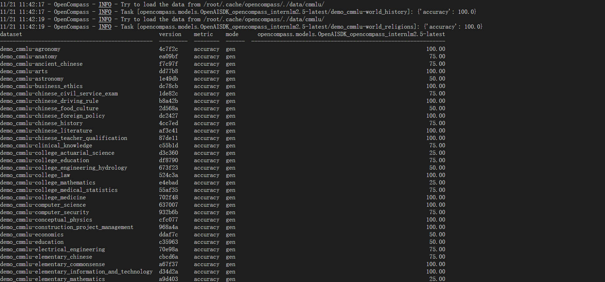

# 书生大模型实战营 模型评测


## 环境搭建

```bash
conda create -n opencompass python=3.10 -y
conda activate opencompass

cd ~
git clone -b 0.3.3 https://github.com/open-compass/opencompass
cd opencompass

pip install -r requirements.txt
pip install huggingface_hub==0.25.2
pip install importlib_metadata
pip install -e .
```


## 评测 API 模型

这里以 internlm 模型为例。

1. 获取 API_KEY

    首先打开官方网站  https://internlm.intern-ai.org.cn/api/document 获得 API_KEY，切记不要将 API_KEY 暴露在公开代码中！

2. 配置 PUYU 模型

    新建 `opencompass/configs/models/puyu_api.py` 文件：

```python
import os
from opencompass.models import OpenAISDK


internlm_url = 'https://internlm-chat.intern-ai.org.cn/puyu/api/v1/' # 你前面获得的 api 服务地址
internlm_api_key = os.getenv('INTERNLM_API_KEY')

models = [
    dict(
        # abbr='internlm2.5-latest',
        type=OpenAISDK,
        path='internlm2.5-latest', # 请求服务时的 model name
        # 换成自己申请的APIkey
        key=internlm_api_key, # API key
        openai_api_base=internlm_url, # 服务地址
        rpm_verbose=True, # 是否打印请求速率
        query_per_second=0.16, # 服务请求速率
        max_out_len=1024, # 最大输出长度
        max_seq_len=4096, # 最大输入长度
        temperature=0.01, # 生成温度
        batch_size=1, # 批处理大小
        retry=3, # 重试次数
    )
]
```

3. 配置数据集

    可直接采用 `opencompass/configs/datasets/demo/demo_cmmlu_chat_gen.py`，内容如下：

```python
from mmengine import read_base

with read_base():
    from ..cmmlu.cmmlu_gen_c13365 import cmmlu_datasets

# 每个数据集只取前4个样本进行评测
for d in cmmlu_datasets:
    d['abbr'] = 'demo_' + d['abbr']
    d['reader_cfg']['test_range'] = '[0:4]'
```

4. 运行评测

```bash
INTERNLM_API_KEY='xxxxx' python run.py --models puyu_api.py --datasets demo_cmmlu_chat_gen.py --debug
```

运行结果如下：




## 评测本地模型


