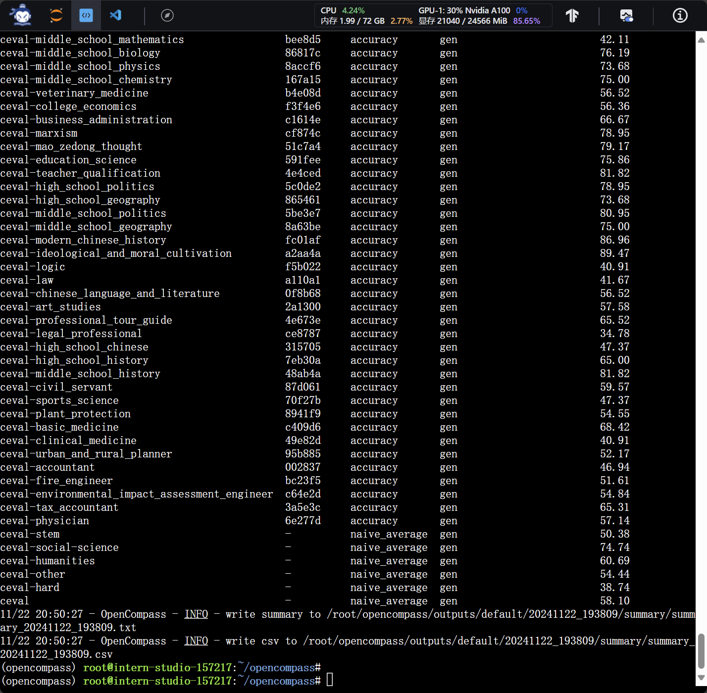

# 书生大模型实战营 模型评测


## 环境搭建

```bash
conda create -n opencompass python=3.10 -y
conda activate opencompass

cd ~
git clone -b 0.3.3 https://github.com/open-compass/opencompass
cd opencompass

pip install -r requirements.txt
pip install huggingface_hub==0.25.2
pip install importlib_metadata
pip install -e .
```


## 评测 API 模型

这里以 internlm 模型为例。

1. 获取 API_KEY

    首先打开官方网站  https://internlm.intern-ai.org.cn/api/document 获得 API_KEY，切记不要将 API_KEY 暴露在公开代码中！

2. 配置 PUYU 模型

    新建 `opencompass/configs/models/puyu_api.py` 文件：

```python
import os
from opencompass.models import OpenAISDK


internlm_url = 'https://internlm-chat.intern-ai.org.cn/puyu/api/v1/' # 你前面获得的 api 服务地址
internlm_api_key = os.getenv('INTERNLM_API_KEY')

models = [
    dict(
        # abbr='internlm2.5-latest',
        type=OpenAISDK,
        path='internlm2.5-latest', # 请求服务时的 model name
        # 换成自己申请的APIkey
        key=internlm_api_key, # API key
        openai_api_base=internlm_url, # 服务地址
        rpm_verbose=True, # 是否打印请求速率
        query_per_second=0.16, # 服务请求速率
        max_out_len=1024, # 最大输出长度
        max_seq_len=4096, # 最大输入长度
        temperature=0.01, # 生成温度
        batch_size=1, # 批处理大小
        retry=3, # 重试次数
    )
]
```

3. 配置数据集

    可直接采用 `opencompass/configs/datasets/demo/demo_cmmlu_chat_gen.py`，内容如下：

```python
from mmengine import read_base

with read_base():
    from ..cmmlu.cmmlu_gen_c13365 import cmmlu_datasets

# 每个数据集只取前4个样本进行评测
for d in cmmlu_datasets:
    d['abbr'] = 'demo_' + d['abbr']
    d['reader_cfg']['test_range'] = '[0:4]'
```

4. 运行评测

```bash
INTERNLM_API_KEY='xxxxx' python run.py --models puyu_api.py --datasets demo_cmmlu_chat_gen.py --debug
```

运行结果如下：


## 评测本地模型

这里以 InternLM2.5-Chat-1.8B 模型为例。


1. 评测准备

```bash
cd /root/opencompass
conda activate opencompass
conda install pytorch==2.1.2 torchvision==0.16.2 torchaudio==2.1.2 pytorch-cuda=12.1 -c pytorch -c nvidia -y
apt-get update
apt-get install cmake
pip install protobuf==4.25.3
pip install huggingface-hub==0.23.2
```

C-Eval 评测数据下载：

```bash
cp /share/temp/datasets/OpenCompassData-core-20231110.zip /root/opencompass/
unzip OpenCompassData-core-20231110.zip
```

2. 配置模型

修改 `configs/models/hf_internlm/hf_internlm2_5_1_8b_chat.py ` 文件：

```python
from opencompass.models import HuggingFacewithChatTemplate

models = [
    dict(
        type=HuggingFacewithChatTemplate,
        abbr='internlm2_5-1_8b-chat-hf',
        path='/share/new_models/Shanghai_AI_Laboratory/internlm2_5-1_8b-chat/',
        max_out_len=2048,
        batch_size=8,
        run_cfg=dict(num_gpus=1),
    )
]
```

3. 启动评测

```bash
python run.py --datasets ceval_gen --models hf_internlm2_5_1_8b_chat
```


## LmDeploy 部署后评测

安装依赖

```bash
pip install lmdeploy==0.6.1 openai==1.52.0
```

运行 lmdeploy 部署运行，提供 OpenAI API 服务：

```bash
lmdeploy serve api_server /share/new_models/Shanghai_AI_Laboratory/internlm2_5-1_8b-chat/ --server-port 23333
```


接着，创建文件 `/root/opencompass/configs/models/hf_internlm/hf_internlm2_5_1_8b_chat_api.py`

```python
from opencompass.models import OpenAI

api_meta_template = dict(
    round=[
        dict(role='HUMAN', api_role='HUMAN'),
        dict(role='BOT', api_role='BOT', generate=True),
    ]
)

models = [
    dict(
        abbr='InternLM-2.5-1.8B-Chat',
        type=OpenAI,
        path='/share/new_models/Shanghai_AI_Laboratory/internlm2_5-1_8b-chat/', # 注册的模型名称
        key='sk-123456',
        openai_api_base='http://0.0.0.0:23333/v1/chat/completions',
        meta_template=api_meta_template,
        query_per_second=1,
        max_out_len=2048,
        max_seq_len=4096,
        batch_size=8),
]

```

接着运行：

```bash
opencompass --models hf_internlm2_5_1_8b_chat_api.py --datasets ceval_gen
```



