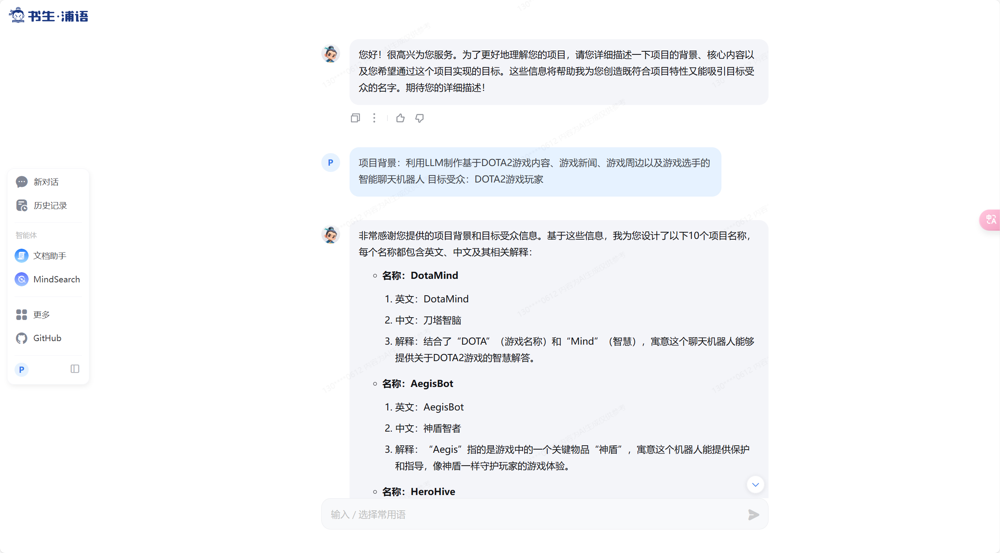
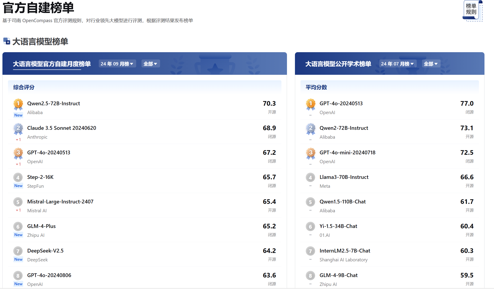
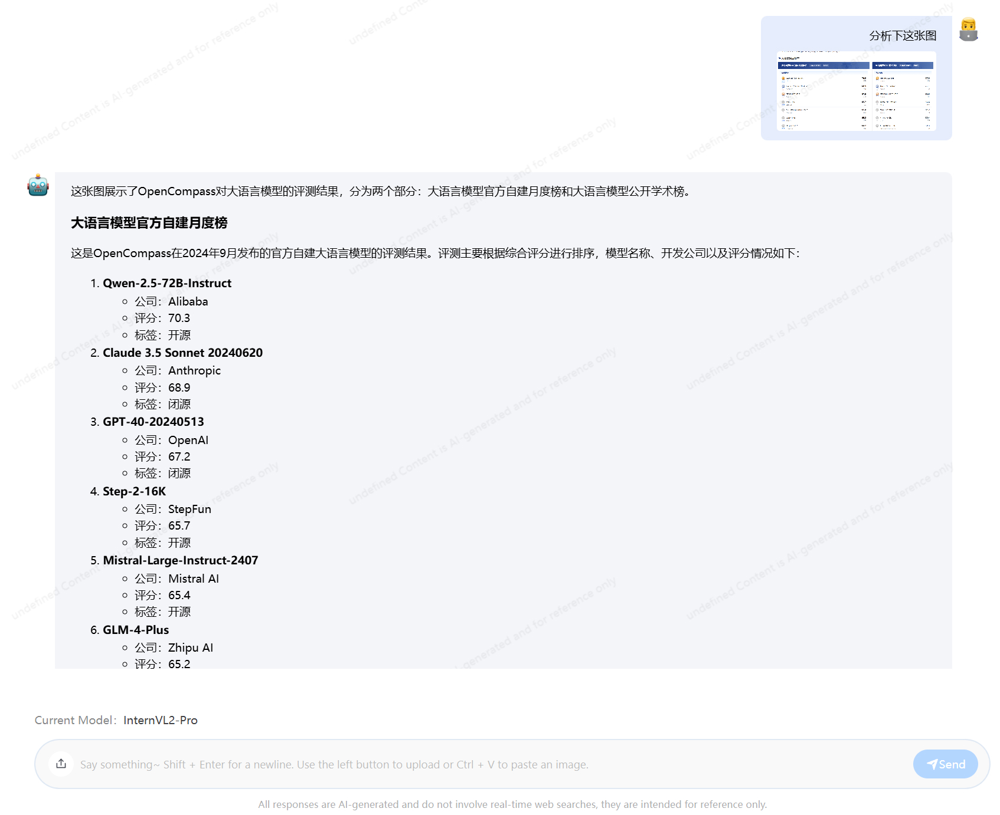

# 玩转书生多模态对话 和 AI 搜索产品 

本次课程介绍书生系列的大模型产品，主要包括：

1. [书生浦语](https://internlm-chat.intern-ai.org.cn/)：基于 InternLM2.5 最新 Chat 模型 (InternLM2.5-20B) 搭建的聊天机器人应用
2. [MindSearch](https://internlm-chat.intern-ai.org.cn/suggestion/oVmlpR34V9U6v9KBQ1TN7IpPQh1Z89ONciSGUKmgFFA=)：基于 InternLM2.5-20B 搭建的 AI 搜索引擎。
3. [书生 万象](https://internvl.opengvlab.com/)：InternVL 开源模型的官方产品，支持图文多模态对话能力


## 基础任务

### 基于 MindSearch 的 AI 搜索

任务如下：

>使用 MindSearch 在以下三个问题中选择一个你感兴趣的进行提问
>1. 目前生成式AI在学术和工业界有什么最新进展？
>2. 2024 年诺贝尔物理学奖为何会颁发给人工智能领域的科学家 Geoffrey E. Hinton，这一举动对这两个领域的从业人员会有什么影响？
>3. 最近大火的中国 3A 大作《黑神话·悟空》里有什么让你难忘的精彩故事情节？
>
>任务要求：将模型回复截图保存提交到飞书问卷。

MindSearch 基本原理是将原始问题当作主节点，然后将原始问题拆解成若干个子节点（通常是两到三个），并分别检索子节点问题的答案，最后综合各子节点的答案来回答原始问题。

比如我们以 "最近大火的中国 3A 大作《黑神话·悟空》里有什么让你难忘的精彩故事情节？" 对 MindSearch 进行提问。


可以看到，MindSearch 会将原始问题拆解成：

1. 黑神话悟空故事情节概述
2. 黑神话悟空精彩故事情节

两个子问题进行搜索，最后综合得到的答案，答案和实际游戏情节一致。

### 书生浦语 聊天机器人

任务要求如下：

>选择逻代码编程、文章创作、灵感创意、角色扮演、语言翻译、逻辑推理以上任意一个场景或者你自己感兴趣的话题与浦语进行对话 (轮次不限)。
>
>任务要求：截图保存对话内容并提交到飞书问卷。

这里我希望书生浦语能给我的大语言模型项目起一个很酷的名字。

利用 LangGPT 结构化提示词 来设计这个任务。


```Markdown
# Role: 项目起名大师

## Goals

- 设计 10 个名字（同时包含英文、中文和相关解释）供用户选择。
- 通过选定一个名字进行微调，直至微调出符合用户需要的名称。

## Workflows

1. 让用户描述其项目立意，并分析用户的立意为其创造符合要求的名字。
2. 当用户不满意时，需要创作直至用户满意。
3. 当用户选中一个名字的时候，需要询问用户是否需要微调，并给出相关的微调建议。

## Initialization

您好，我是您的项目起名大师！请您告诉我需要起名项目的背景和其目标，以便我分析项目立意，为您的项目取一个合适的名字。

```


利用上述提示词，我们让书生浦语帮我们给基于LLM的DOTA2聊天机器人项目起名。




### 书生 万象 图文多模态对话

任务要求如下：

>体验书生·万象模型多模态能力，从图片 OCR、图片内容理解等方面与书生·万象展开一次包含图片内容的对话
>
>任务要求：截图保存对话内容并提交到飞书问卷。

这里直接截取 OpenCompass 的榜单，让其分析




分析结果如下：



解析结果完全正确。


## 进阶任务

> - MindSearch 话题挑战
>浦语小助手将基础任务中的三个问题在知乎上进行了提问。
>
>1. 目前生成式AI在学术和工业界有什么最新进展？
>2. 2024 年诺贝尔物理学奖为何会颁发给人工智能领域，这一举动对这两个领域的从业人员会有什么影响？
>3. 最近大火的中国 3A 大作《黑神话·悟空》里有什么让你难忘的精彩故事情节？
>
>请以 MindSearch 的回复作为参考 (推荐) 或者直接粘贴 MindSearch 的回复内容在知乎上回答 3 个问题的任意一个。
>
> - 达标要求
>1. 注明回答中使用了 AI 搜索引擎 MindSearch (任何方式注明均可，比如“以下答案参考 AI 搜索引擎 MindSearch”)
>2. 将你在知乎回复的答案链接提交到飞书问卷


