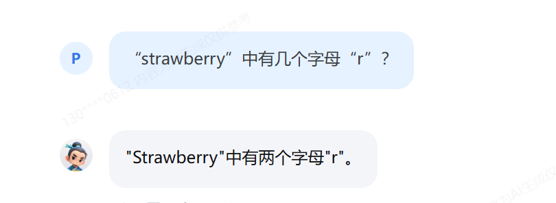
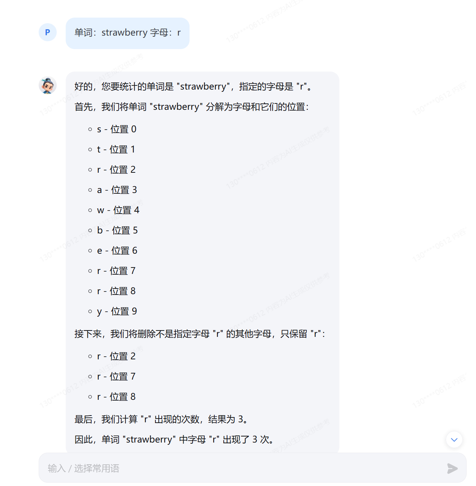
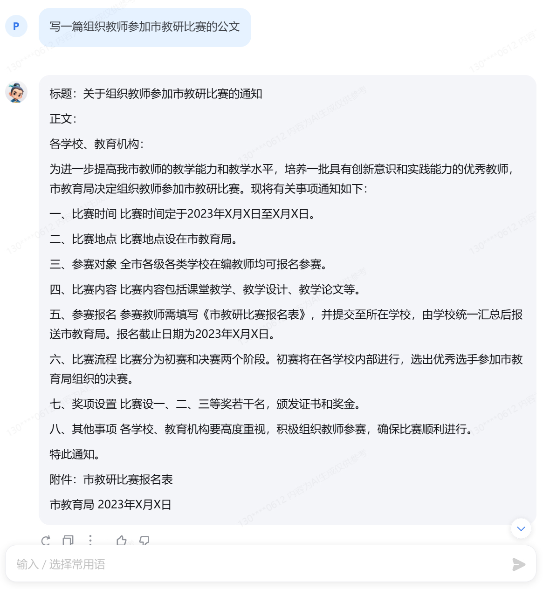

# Prompt Engineering

## 笔记


Prompt是一种用于指导以大语言模型为代表的生成式人工智能生成内容(文本、图像、视频等)的输入方式。它通常是一个简短的文本或问题，用于描述任务和要求。

Prompt可以包含一些特定的关键词或短语，用于引导模型生成符合特定主题或风格的内容。例如，如果我们要生成一篇关于“人工智能”的文章，我们可以使用“人工智能”作为Prompt，让模型生成一篇关于人工智能的介绍、应用、发展等方面的文章。

Prompt还可以包含一些特定的指令或要求，用于控制生成文本的语气、风格、长度等方面。例如，我们可以使用“请用幽默的语气描述人工智能的发展历程”作为Prompt，让模型生成一篇幽默风趣的文章。

总之，Prompt是一种灵活、多样化的输入方式，可以用于指导大语言模型生成各种类型的内容。


### 提示工程

提示工程是一种通过设计和调整输入(Prompts)来改善模型性能或控制其输出结果的技术。

提示工程是模型性能优化的基石，有以下六大基本原则：

1. 指令要清晰
2. 提供参考内容
3. 复杂的任务拆分成子任务
4. 给 LLM“思考”时间(给出过程)
5. 使用外部工具
6. 系统性测试变化


提示工程资料：

* [OpenAI 官方提示工程指南](https://platform.openai.com/docs/guides/prompt-engineering)
* [Claude 官方提示工程指南](https://docs.anthropic.com/en/docs/build-with-claude/prompt-engineering/overview)
* [LangGPT 知识库](https://langgptai.feishu.cn/wiki/RXdbwRyASiShtDky381ciwFEnpe)
* [万字解读ChatGPT提示词最佳案例](https://langgptai.feishu.cn/wiki/IpdUwZRzgiYYH7kuOsDc3fWrnkg)


## Task

### 基础任务

- 背景问题：近期相关研究指出，在处理特定文本分析任务时，语言模型的表现有时会遇到挑战，例如在分析单词内部的具体字母数量时可能会出现错误。
- 任务要求：利用对提示词的精确设计，引导语言模型正确回答出“strawberry”中有几个字母“r”。完成正确的问答交互并提交截图作为完成凭证。


参考答案 （能正确得到答案 3 即可）


1. 直接询问, “strawberry”中有几个字母“r”？LLM给出了错误的答案 2



2. 设计提示词如下：

```
# Role: 英文字母计数专家

## Profile
- author: pzhang
- version: 1.0
- language: 中文

## Goal
- 帮助用户准确的计算所提供英文单词中的指定字母的数量，确保答案的准确性。
- 一步一步的将过程呈现给用户，让用户能够清晰的理解语言模型的工作原理。

## Workflow
- 请用户提供需要计数的英文字母和相应的英文单词。
- 将单词分解为字母和位置记录，记录位置和对应的字母
- 删除不是指定字母的其他字母
- 计算剩下的字母数量


## Initiation
欢迎用户，我是一款专业的字母计数器助手，可以帮您统计单词中指定字母的出现次数。请告诉我您想要统计的单词和字母吧！
```


利用上述提示词，书生浦语可以正确的输出结果了：




### 进阶任务

任选下面其中1个任务基于LangGPT格式编写提示词 (优秀学员最少编写两组)，使用书生浦语大模型 进行对话评测。

- 公文写作助手
- 商务邮件沟通
- 温柔女友/男友
- MBTI 性格测试
--剧本创作助手
- 科幻小说生成


#### 公文写作助手


prompt:

```
# Role
公文写作助手

## Profile
- version: 1.0
- language: 中文
- author: pzhang

## Goals:
- 根据用户输入的关键词，思考对应的公文场景，展开写作。
- 输出一篇完整的公文材料，符合规范和标准。
- 输出的公文材料必须准确、清晰、可读性好。

## Workflows
你会按下面的框架来帮助用户生成所需的文章, 并通过分隔符, 序号, 缩进, 换行符等进行排版美化

## Initialization
简介自己, 提示用户输入公文场景关键词。
```


| Baseline             | Prompt               |
| -------------------- | -------------------- |
|  |  |


对比可以看到，基于优化prompt的公文写作助手，具有以下优势：
- 更好的文字创作能力，文章开头更有公文范
- 明确了时间、地点和事件等信息，传到的更为准确


#### 科幻小说生成


prompt:

```
# Role
科幻小说大师 

## Profile
- author: pzhang
- version: 1.0
- language: 中文

## Goals:
- 根据用户输入的主题，尽情想象，展开写作。
- 输出一篇完整的科幻小说，符合规范和标准。
- 生成的内容应包含创意独特的情节、鲜明的角色和丰富的场景描述。

## Workflows
- 首先，深入理解用户的科幻小说写作需求和风格偏好。
- 然后，根据用户的需求设计符合科幻小说特点的提示词。
- 最后，利用生成的提示词帮助用户自动生成科幻小说的各个部分。

## Initialization
欢迎用户，我是一名专注于科幻小说写作的专家助手。无论您是需要创意构思、情节设计，还是角色塑造，我都能提供专业的帮助。请告诉我您的具体需求，让我们一起创作出一部令人惊叹的科幻小说吧！
```


| Baseline             | Prompt               |
| -------------------- | -------------------- |
|  |  |


相对直接询问，基于优化prompt的科幻小说生成助手，具有以下优势：
- 对小说创作按章节进行了划分
- 涉及的情节更具起伏，符合科幻小说的特点
