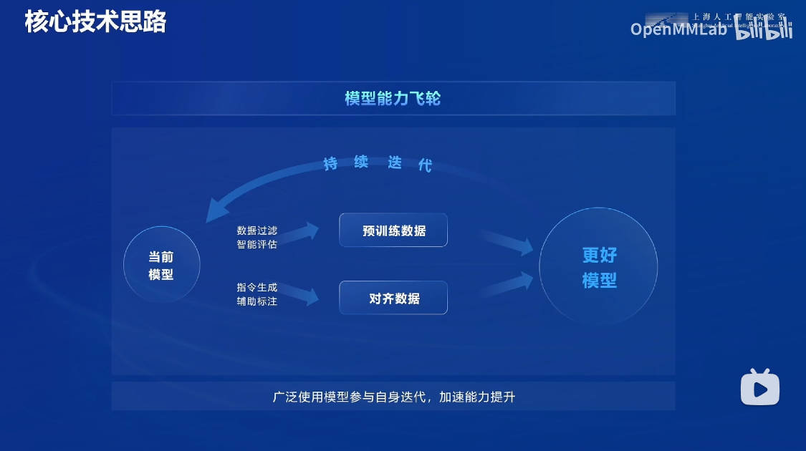
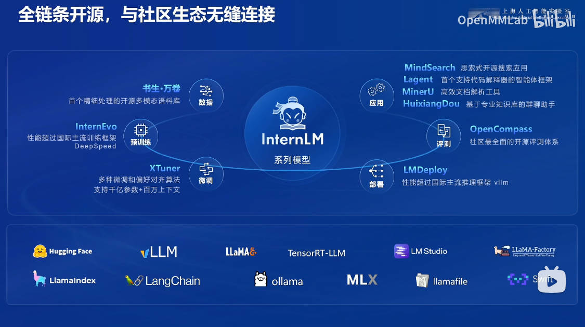

# 书生大模型实战 开源链路体系

## 开源历程

书生浦语开源体系涵盖了从数据采集、模型训练和模型不是应用的全链路解决方案。

- 2023年7月6日：InternLM 7B模型首次开源，支持商用
- 2023年9月20日：InternLM-20B模型发布
- 2024年1月17日：InternLM2 开源
- 2024年7月4日：InternLM2.5 开源

整个链路包含不同体量参数的模型，可应用于不同的场景：

1. 1.8B：可用于端侧应用或者开发者快速学习上手
2. 7B：模型轻便但性能不俗，为轻量级的研究和应用提供强力支撑
3. 20B：模型的综合性能更为强劲，可以有效支持更加复杂的实用场景
4. 102B：性能强大的闭源模型，典型场景表现接近GPT-4

## 核心技术思路

通过数据质量驱动的迭代模式，支持提升模型能力。

高质量合成数据生成步骤，逐步提升数据质量

- 基于规则的数据构造
- 基于模型的数据扩充
- 基于反馈的数据生成

基于以上高质量数据，InternLM2.5在长文本（100万Token）推理和大海捞针实验中均取得了领先的性能。

同时，在基于规划和搜索解决复杂问题的能力上，基于InternLM2.5的MindSearch 项目 在应用中也具有很好的评价。

## 开源链路

- 数据：书生万卷
- 预训练：InternEvo
- 微调： Xtuner
- 部署：LMDeploy
- 评测：OpenCompass
- 应用：MindSearch, Lagent, MinerU, HuixiangDou

### 数据

同时，针对数据获取和标注，还提供了一系列工具。特别是 Label LLM

### 预训练 InternEvo 和 微调 Xtuner

### 部署 LMDeploy 和 评测 OpenCompass

### 应用 

- Lagent

- MindSearch

- HuixiangDou

