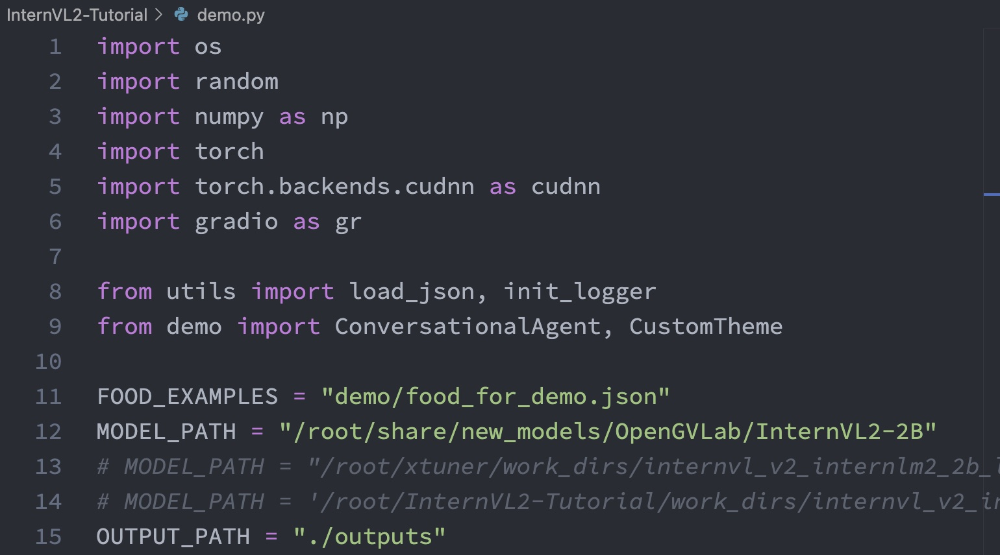
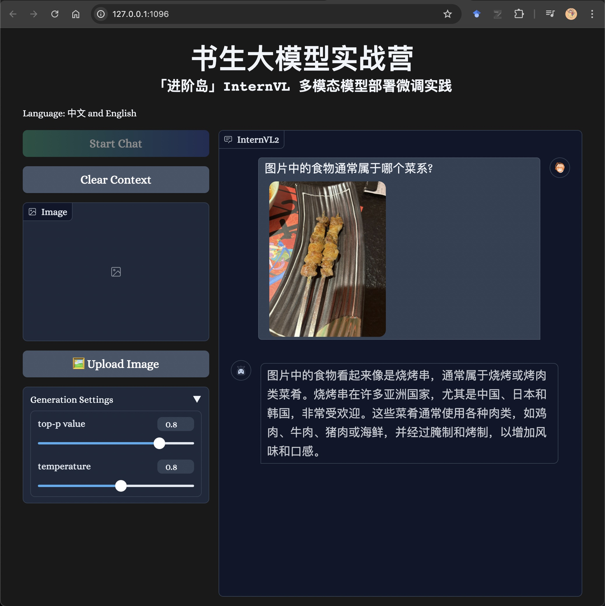
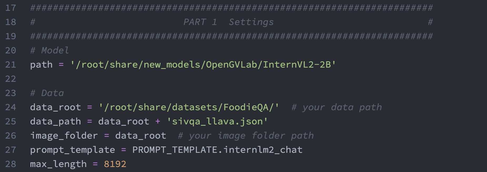
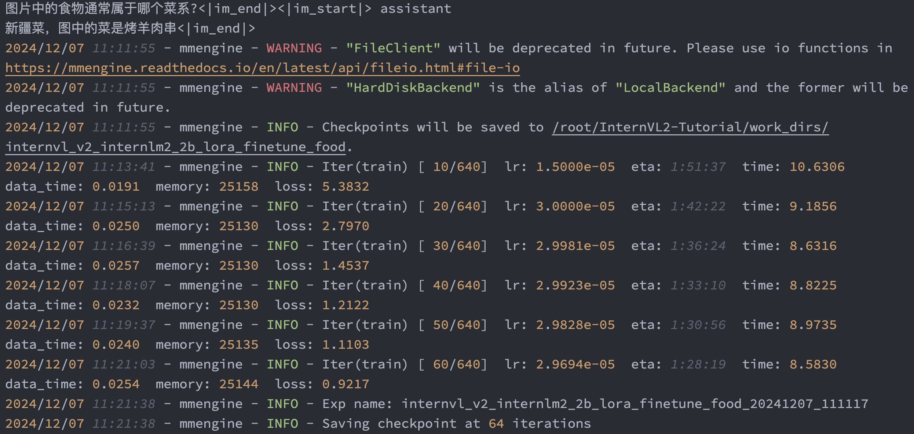
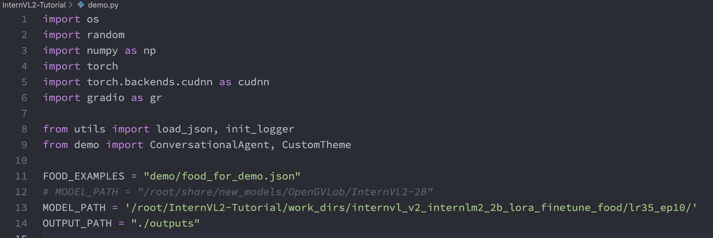
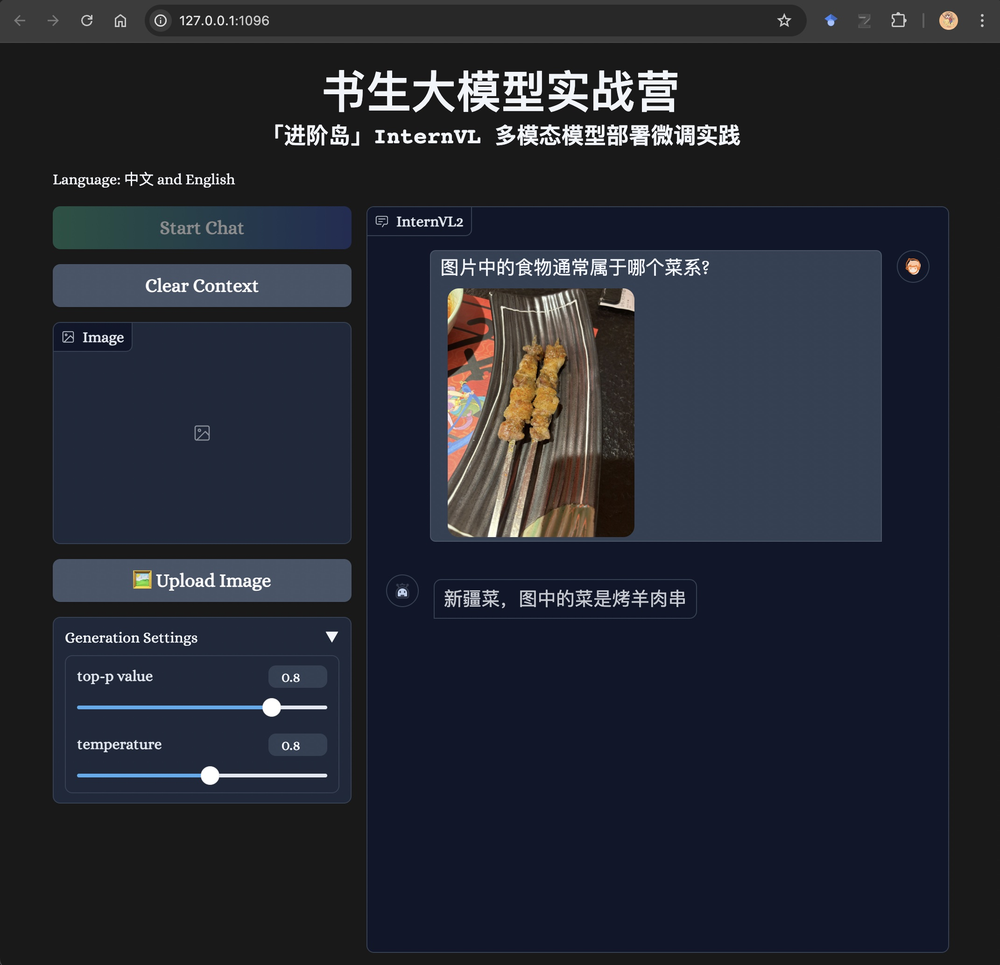

# 书生大模型实战之 InternVL 部署微调

## MLLM 概述

多模态大语言模型（Multimodal Large Language Model）是指能够处理和融合多种不同类型数据
（如文本、图像、音频、视频等）的大型人工智能模型。这些模型同城基于深度学习技术，能够理解和生成
多种模态的数据，从而在各种复杂的应用场景中表现出强大的能力。

常见的 MLLM 有：

- InternVL
- GPT-4o
- Qwen-VL
- LLaVA

多模态大模型的重点是**不同模态特征空间的对齐**。

## InternVL2 设计模式


## LMDeploy 部署 InternVL2

配置环境

```shell
conda create -n lmdeploy python=3.10 -y
conda activate lmdeploy
pip install lmdeploy gradio==4.44.1 timm=1.0.9
```

Gradio 部署

```shell
git clone https://github.com/Control-derek/InternVL2-Tutorial.git
cd InternVL2-Tutorial
```

修改 `demo.py` 中的 `MODEL_PATH` 为 InternVL2-2B 模型的路径：



接着启动demo：

```shell
python demo.py
```

接着在浏览器中打开相应链接，看到如下界面，点击 Start Chat 即可开始聊天：



此时采用的是原始 InternVL2-2B 模型，回答不够准确。

## Xtuner 微调 InternVL2

1. 配置环境

```shell
conda create --name xtuner python=3.10 -y
conda activate xtuner

pip install -U 'xtuner[deepspeed]' timm==1.0.9
pip install torch==2.4.1 torchvision==0.19.1 torchaudio==2.4.1 --index-url https://download.pytorch.org/whl/cu121
pip install transformers==4.39.0
```


2. 数据集准备

采用 FoodieQA 数据集，FoodieQA 是一个专门为研究中国各地美食文化而设计的数据集。它包含了大量关于食物的图片和问题，帮助多模态大模型更好地理解不同地区的饮食习惯和文化特色。这个数据集的推出，让我们能够更深入地探索和理解食物背后的文化意义。

```cite
@article{li2024foodieqa,
  title={FoodieQA: A Multimodal Dataset for Fine-Grained Understanding of Chinese Food Culture},
  author={Li, Wenyan and Zhang, Xinyu and Li, Jiaang and Peng, Qiwei and Tang, Raphael and Zhou, Li and Zhang, Weijia and Hu, Guimin and Yuan, Yifei and S{\o}gaard, Anders and others},
  journal={arXiv preprint arXiv:2406.11030},
  year={2024}
}
```

数据集下载：

```shell
huggingface-cli download --repo-type dataset lyan62/FoodieQA --local-dir /root/huggingface/FoodieQA 
```

修改 `InternVL2-Tutorial` 目录下的 `process_food.py` 中的数据目录后运行：

```shell
python process_food.py
```

3. 准备配置文件

该数据集的微调配置文件： `InternVL2-Tutorial/xtuner_config/internvl_v2_internlm2_2b_lora_finetune_food.py`

修改其中的 `path`, `data_root` 和 `image_folder` 为正确的路径：




其中部分参数：

- `path`: 需要微调的模型路径，在InternStudio环境下，无需修改
- `data_root`: 数据集所在路径。
- `data_path`: 训练数据文件路径。
- `image_folder`: 训练图像根路径。
- `prompt_temple`: 配置模型训练时使用的聊天模板、系统提示等。使用与模型对应的即可，此处无需修改。
- `max_length`: 训练数据每一条最大token数。
- `batch_size`: 训练批次大小，可以根据显存大小调
- `accumulative_counts`: 梯度累积的步数，用于模拟较大的batch_size，在显存有限的情况下，提高训练稳定性。
- `dataloader_num_workers`: 指定数据集加载时子进程的个数。
- `max_epochs`:训练轮次。
- `optim_type`:优化器类型。
- `lr`: 学习率
- `betas`: Adam优化器的beta1, beta2
- `weight_decay`: 权重衰减，防止训练过拟合用
- `max_norm`: 梯度裁剪时的梯度最大值
- `warmup_ratio`: 预热比例，前多少的数据训练时，学习率将会逐步增加。
- `save_steps`: 多少步存一次checkpoint
- `save_total_limit`: 最多保存几个checkpoint，设为-1即无限制

LoRA 相关参数：

- `r`: 低秩矩阵的秩，决定了低秩矩阵的维度。
- `lora_alpha` 缩放因子，用于调整低秩矩阵的权重。
- `lora_dropout` dropout 概率，以防止过拟合

4. 开始微调

```shell
xtuner train xtuner_config/internvl_v2_internlm2_2b_lora_finetune_food.py --deepspeed deepspeed_zero2
```

当看到如下输出时，即是正常运行。在 50% A100 GPU 下，大约运行 1 小时。




微调完成后，将权重转换为 InternVL2 官方格式：

```shell
git clone https://github.com/InternLM/xtuner.git
cd xtuner
python xtuner/configs/internvl/v1_5/convert_to_official.py xtuner_config/internvl_v2_internlm2_2b_lora_finetune_food.py ./work_dirs/internvl_v2_internlm2_2b_lora_finetune_food/iter_640.pth ./work_dirs/internvl_v2_internlm2_2b_lora_finetune_food/lr35_ep10/
```


4. AI 美食模型对话

修改 `demo.py` 中的 MODEL_PATH 为刚转换完成的模型路径：



启动网页应用：

```shell
conda activate lmdeploy
python demo.py
```

与微调前相比，回答更准确。

| 微调前                 | 微调后                 |
| ---------------------- | ---------------------- |
|  |  |
