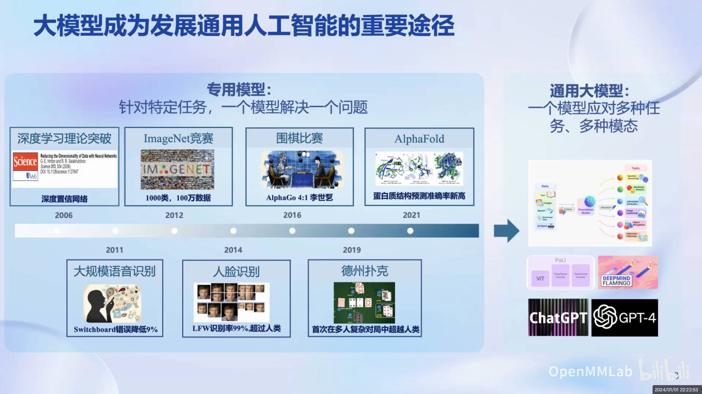
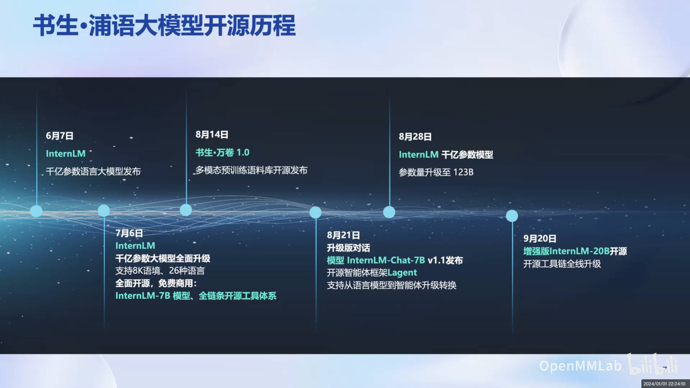
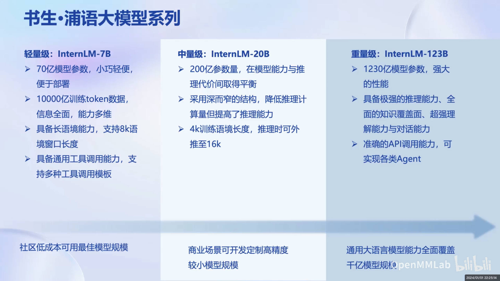
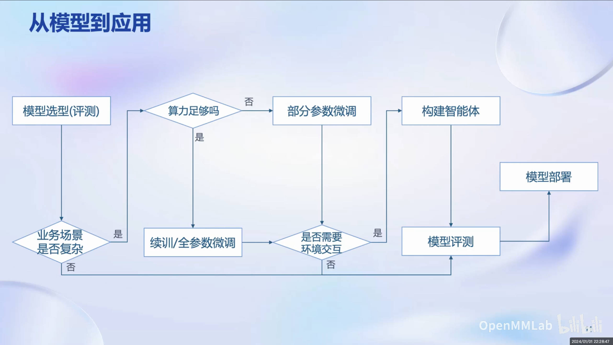
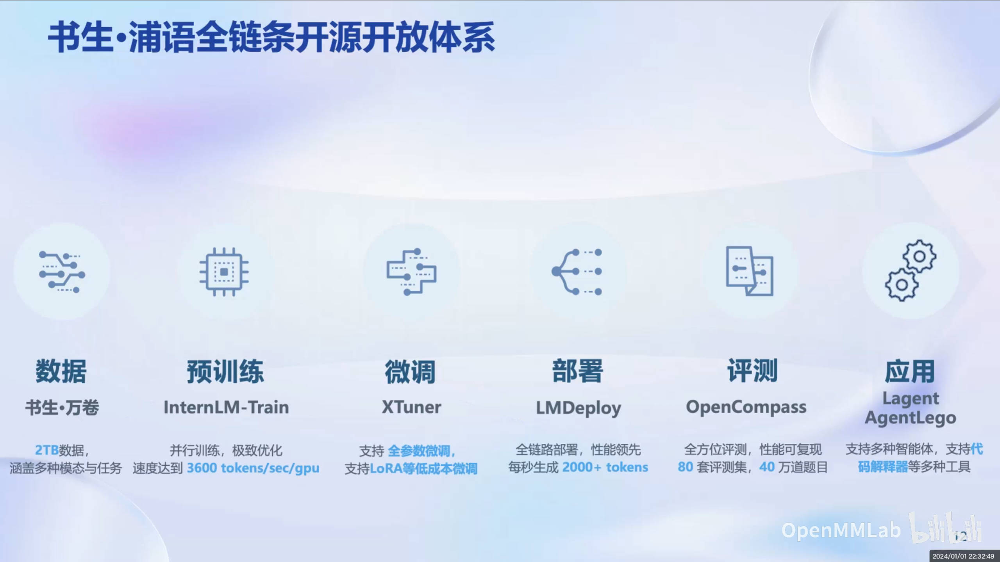
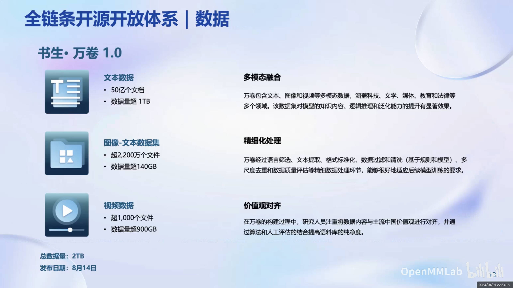
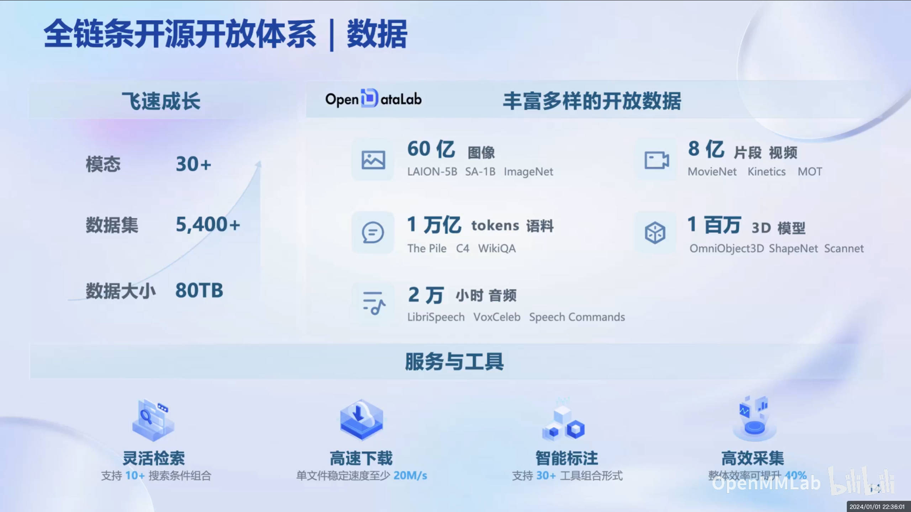
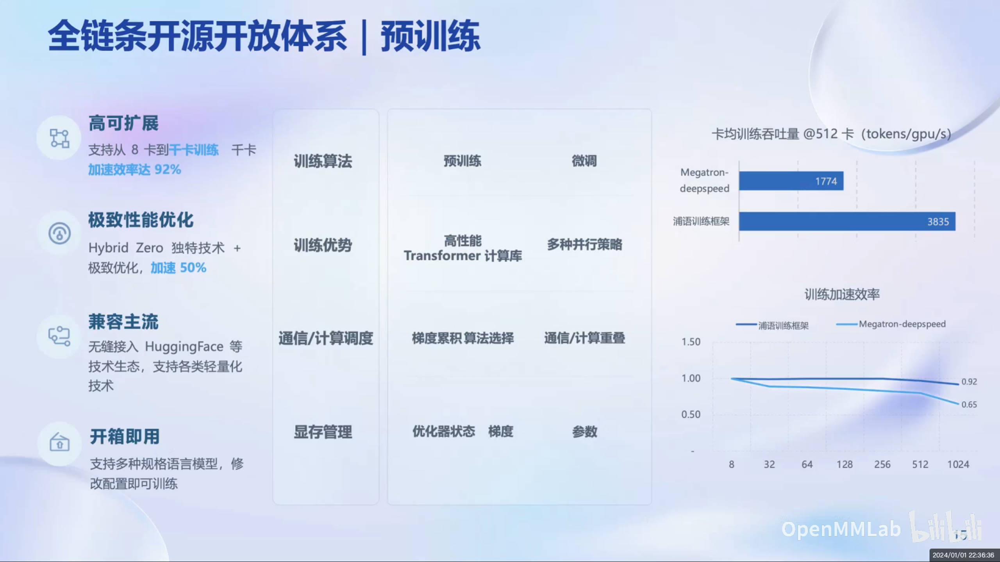

# 第1节：书生·浦语大模型全链路开源体系

## 概述

本节课中，上海人工智能实验室青年科学家陈凯，为大家介绍了浦语大模型全链路开源体系。

### 大模型介绍

大模型成为发展通用人工智能的重要途径，发展趋势由专用模型到通用模型。

书生·浦语大模型 是上海人工智能实验室研发的多模态大模型。其包含轻量级、中量级和重量级三个版本：

- InternLM-7B: 10000亿训练token数据，支持8k语境窗口长度，适用于社区低成本使用
- InternLM-20B：4k训练语境长度，推理时可外推至16k语境窗口长度，适用于商业场景开发定制高精度模型
- InternLM-123B：具备极强的推理能力，全面的知识面覆盖、超强理解能力与对话能力，覆盖通用大语言模型能力

### 模型应用

需针对应用场景选择合适的模型

## 书生·浦语全链条开源开放体系

数据、预训练、微调、部署、评测、应用

### 数据

书生 万卷1.0：多模态融合、精细化处理、价值观对齐

- 文本数据：50亿文档，数据量超1TB
- 图像-文本数据集：2200万文件，数据量超140GB
- 视频数据：1000个文件，数据量超900GB

OpenDataLab：数据开放平台，提供数据下载、标注、训练、评测、分享等服务

### 预训练

高可扩展、极致性能优化、兼容主流、开箱即用

### 微调

高校微调框架 XTuner

### 部署

