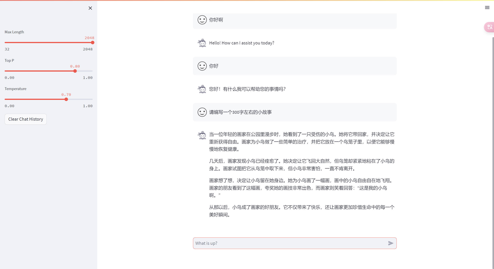
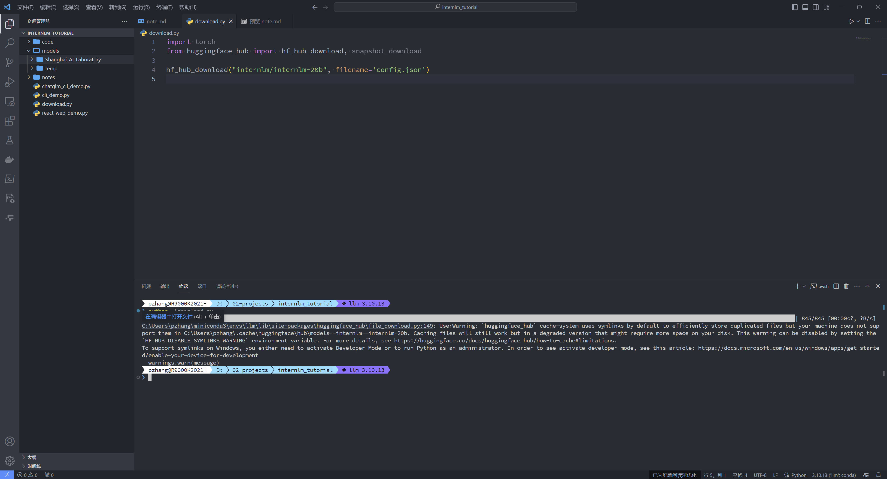
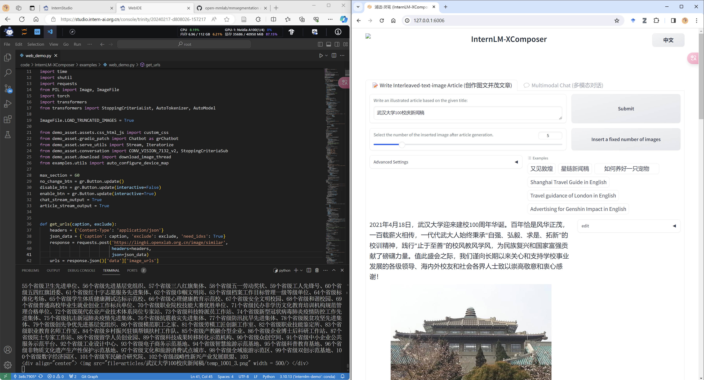
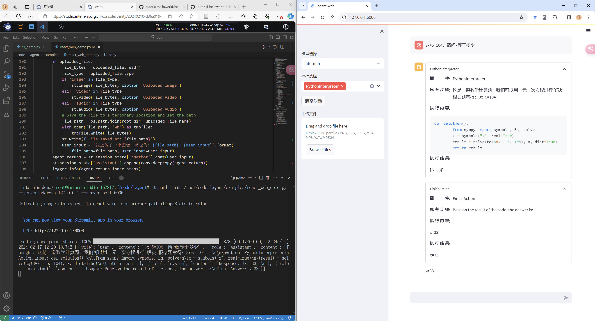

# 第2节：书生·浦语大模型趣味demo 课后作业

>**基础作业**：
>
> - 使用 InternLM-Chat-7B 模型生成 300 字的小故事（需截图）。
> - 熟悉 hugging face 下载功能，使用 huggingface_hub python 包，下载 InternLM-20B 的 config.json 文件到本地（需截图下载过程）。
>
>**进阶作业（可选做）**
>
>- 完成浦语·灵笔的图文理解及创作部署（需截图）
>- 完成 Lagent 工具调用 Demo 创作部署（需截图）

## 基础作业

### 使用 InternLM-Chat-7B 模型生成 300 字的小故事

### hugging face 下载功能

## 进阶作业

### 浦语·灵笔的图文理解及创作部署

### Lagent 工具调用 Demo 创作部署

