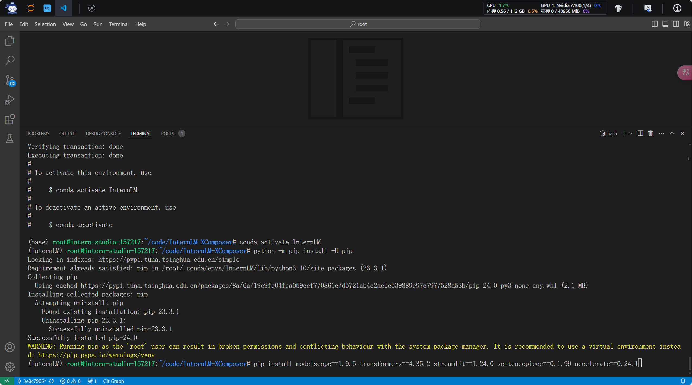
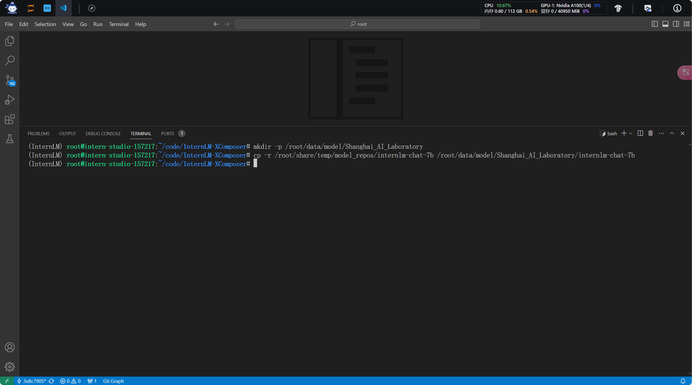
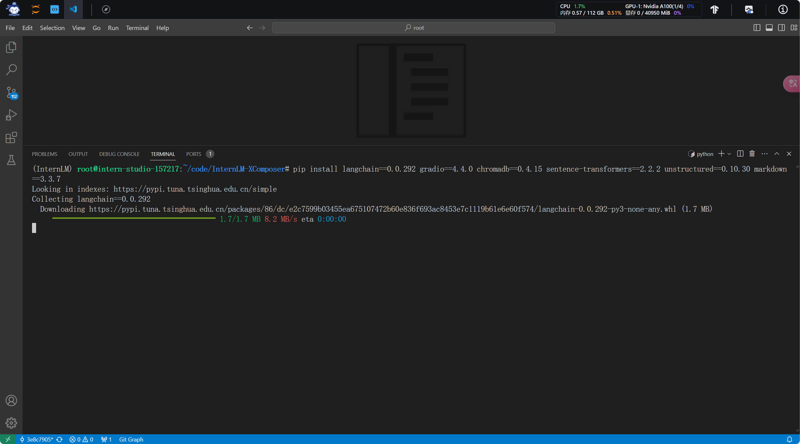
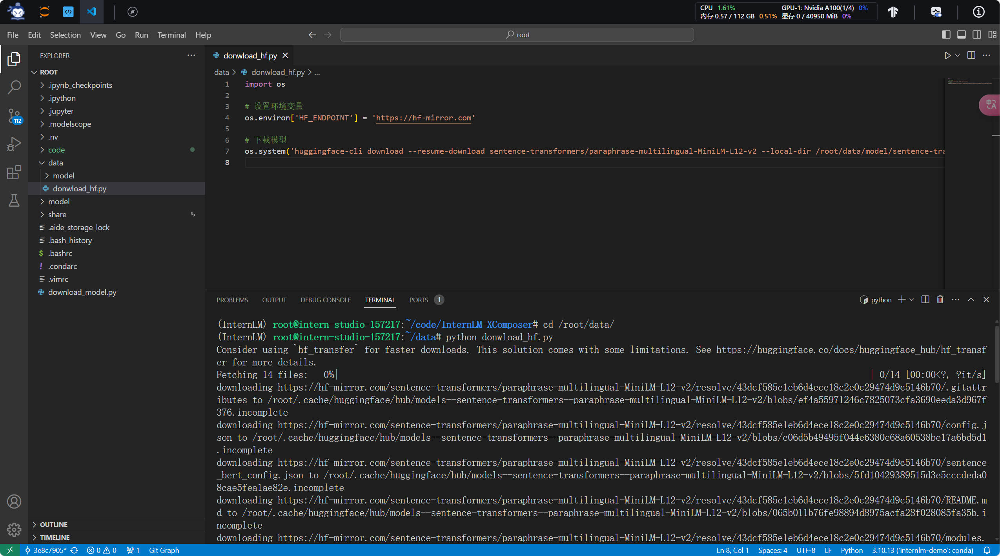
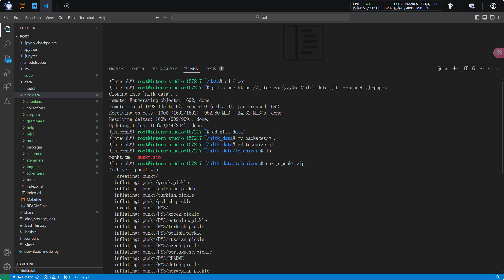
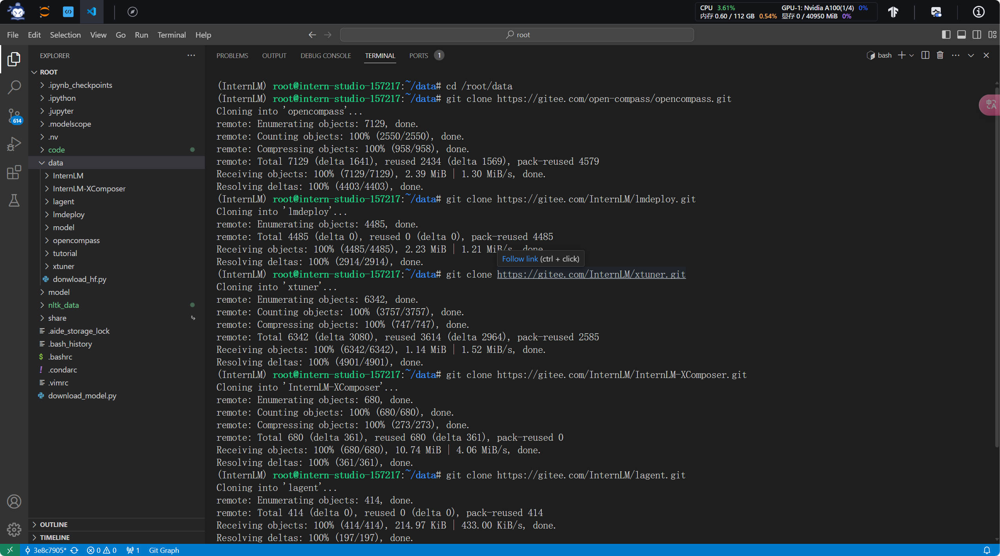
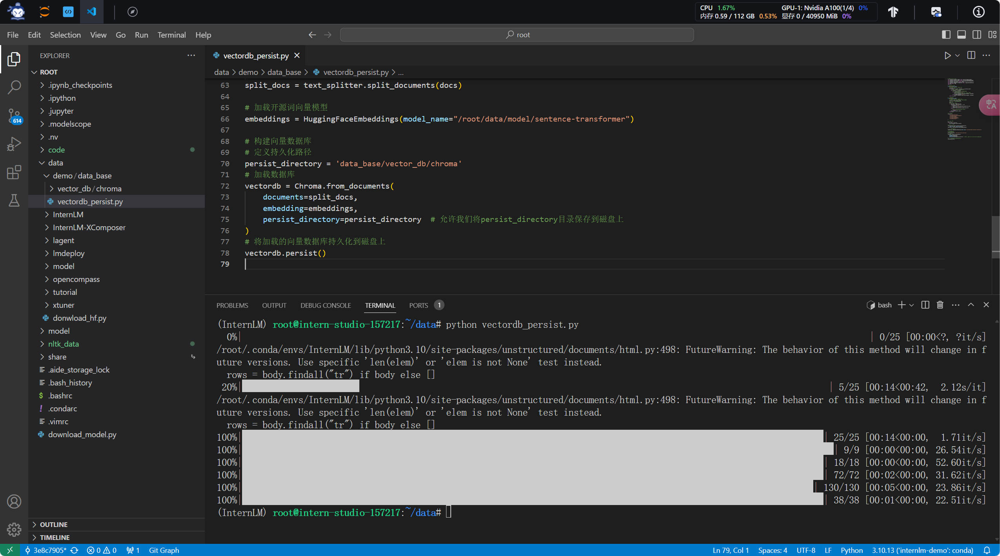
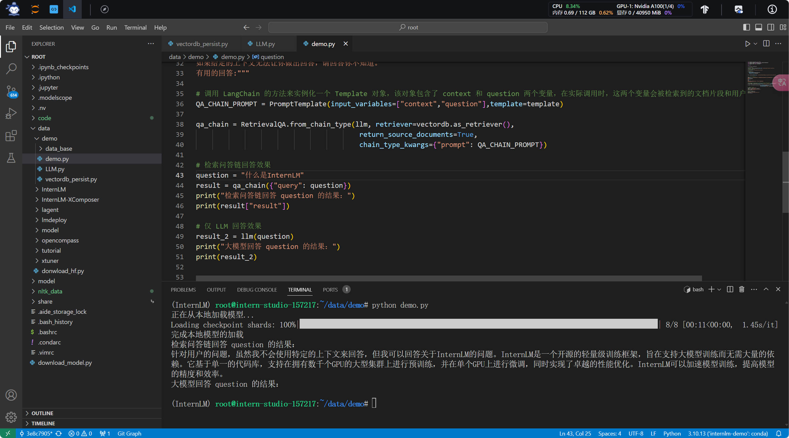
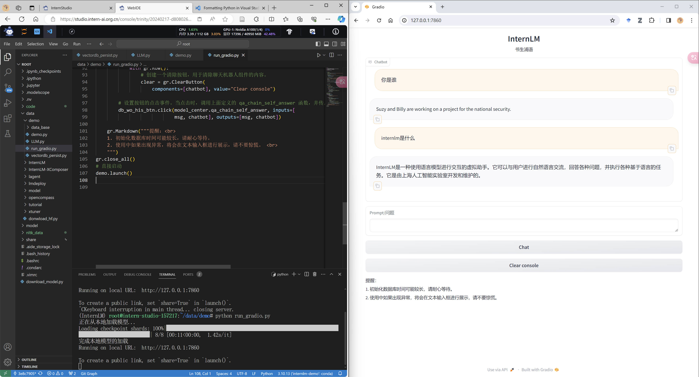

# 课后作业

>**基础作业**：
>
>复现课程知识库助手搭建过程 (截图)
>
>**进阶作业**：
>
>选择一个垂直领域，收集该领域的专业资料构建专业知识库，并搭建专业问答助手，并在 OpenXLab 上成功部署（截图，并提供应用地址）

## 基础作业

### 环境配置

### 模型下载

### LangChain 环境

### Sentence Transfomrer 模型下载

### NLTK 资源下载

### 数据收集

### 构建向量数据库

### 检索问答链和LLM回答对比

### 部署web demo

## 进阶作业

