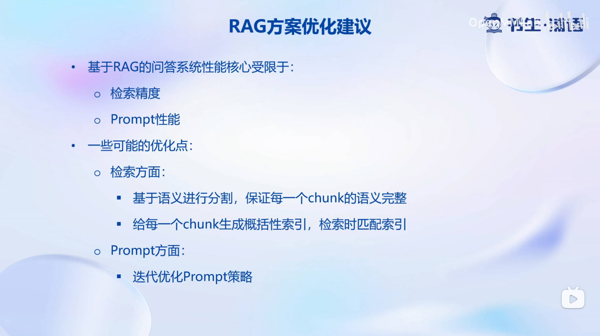

# 第3节：基于 InternLM 和 LangChain 搭建你的知识库

## 概述

本节课程由 prompt-engineering-for-developers 开源项目负责人 邹雨衡 讲授。

## 大模型开发范式

LLM 具有以下局限性：

- 知识时效性受限：如何让LLM获取最新的知识
- 专业能力有限：如何打造垂域大模型
- 定制化成本高：如何打造个人专属的LLM应用

目前针对上述问题，LLM主要有两种开发范式：

- RAG
- Finetune

## LangChain 简介

LangChain 框架是一个开源工具，通过为各种 LLM 提供通用接口来简化应用程序的开发流程，帮助开发者自由构建 LLM 应用。

核心组件

- Chains：将组件组合实现端到端应用，通过一个对象封装实现一系列 LLM 操作。

Eg. 检索问答链，覆盖实现了 RAG(检索增强生成)的全部流程

## 构建向量数据库

LangChain 支持自定义 LLM，只需要将 InternLM 部署在本地，并封装一个自定义 LLM 类，调用本地 InternLM 即可将 InternLM 接入 LangChain。

RAG 方案优化建议：

## web demo 部署

使用 Gradio 或者 Streamlit 等

