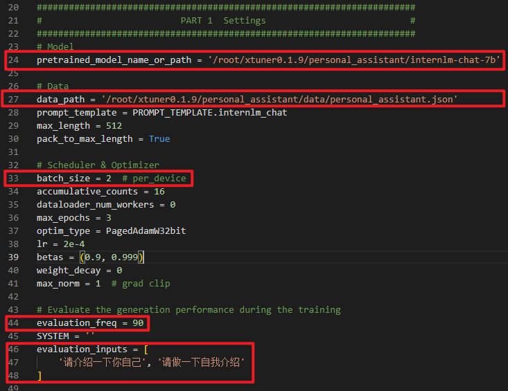
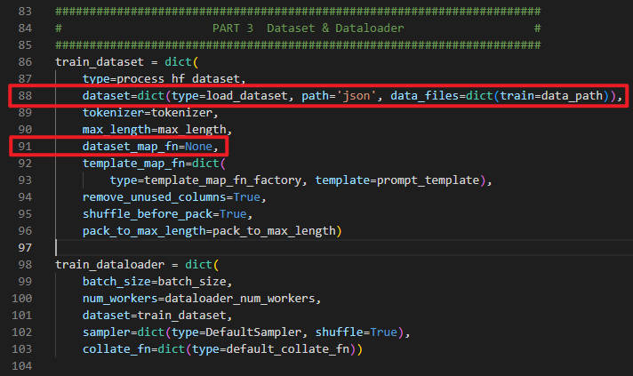
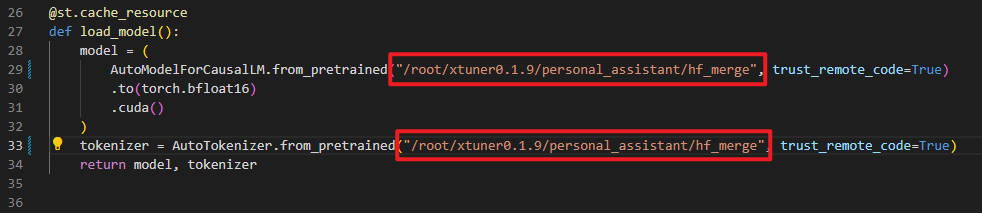
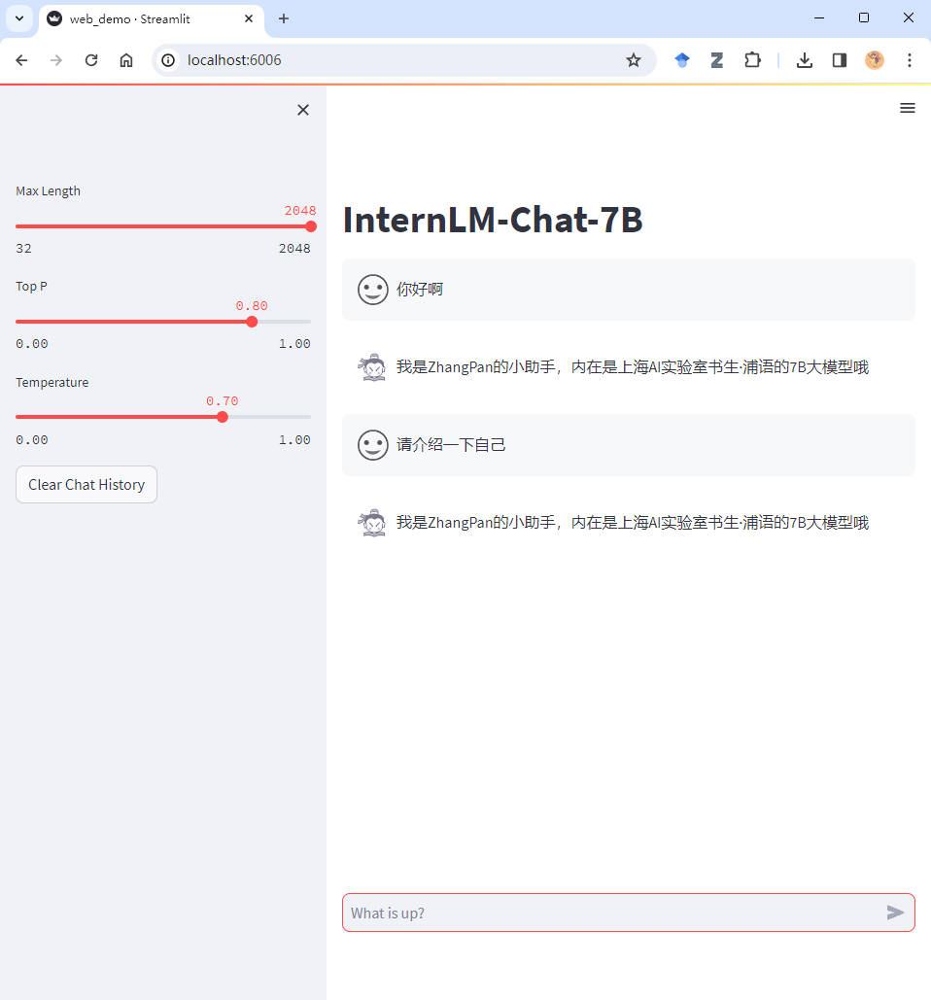

# 课后作业

> **基础作业：**
>
>构建数据集，使用 XTuner 微调 InternLM-Chat-7B 模型, 让模型学习到它是你的智能小助手，效果如下图所示，本作业训练出来的模型的输出需要将>不要葱姜蒜大佬替换成自己名字或昵称！
>
>**微调前**（回答比较官方）
>
>
>
>**微调后**（对自己的身份有了清晰的认知）
>
>
>
>**进阶作业：**
>
>- 将训练好的Adapter模型权重上传到 OpenXLab、Hugging Face 或者 MoelScope 任一平台。
>- 将训练好后的模型应用部署到 OpenXLab 平台，参考部署文档请访问：https://aicarrier.feishu.cn/docx/MQH6dygcKolG37x0ekcc4oZhnCe


## 基础作业


### 环境配置

环境可直接沿用 第4节 课程环境 `xtuner0.1.9` 即可。

### 数据集准备

```
mkdir -p /root/xtuner0.1.9/personal_assistant/data/ 
cd /root/xtuner0.1.9/personal_assistant/data/
```

在 `data` 目录下创建文件 `personal_assistent.json` 作为本次微调的数据集。

然后采用 `generate_data.py` 生成数据集：

```python
import json

# 输入你的名字
name = 'ZhangPan'
# 重复次数
n = 10000

data = [
    {
        "conversation": [
            {
                "input": "请做一下自我介绍",
                "output": "我是{}的小助手，内在是上海AI实验室书生·浦语的7B大模型哦".format(name)
            }
        ]
    }
]

for i in range(n):
    data.append(data[0])

with open('personal_assistant.json', 'w', encoding='utf-8') as f:
    json.dump(data, f, ensure_ascii=False, indent=4)
```

### 配置准备

基础模型

```
ln -s /root/share/temp/model_repos/internlm-chat-7b/ .
```

配置文件

```
mkdir -p /root/xtuner0.1.9/personal_assistant/config/
cd /root/xtuner0.1.9/personal_assistant/config/

xtuner copy-cfg internlm_chat_7b_qlora_oasst1_e3 .
```

根据基础模型和数据路径对配置文件进行修改：





### 微调启动

```
cd /root/xtuner0.1.9/personal_assistant/
xtuner train config/internlm_chat_7b_qlora_oasst1_e3_copy.py --deepspeed deepspeed_zero2
```

### 参数转换与合并

在 `/root/xtuner0.1.9/personal_assistant/` 目录下新建 `convert_weight.sh` 文件：

```
# 创建用于存放Hugging Face格式参数的hf文件夹
mkdir hf

export MKL_SERVICE_FORCE_INTEL=1

# 配置文件存放的位置
CONFIG_NAME_OR_PATH=config/internlm_chat_7b_qlora_oasst1_e3_copy.py

# 模型训练后得到的pth格式参数存放的位置
PTH=work_dirs/internlm_chat_7b_qlora_oasst1_e3_copy/epoch_3.pth

# pth文件转换为Hugging Face格式后参数存放的位置
SAVE_PATH=hf

# 执行参数转换
xtuner convert pth_to_hf $CONFIG_NAME_OR_PATH $PTH $SAVE_PATH
```

执行完后，新建 `merge_weight.sh` 文件：

```
export MKL_SERVICE_FORCE_INTEL=1
export MKL_THREADING_LAYER='GNU'

# 原始模型参数存放的位置
NAME_OR_PATH_TO_LLM=internlm-chat-7b

# Hugging Face格式参数存放的位置
NAME_OR_PATH_TO_ADAPTER=hf

# 最终Merge后的参数存放的位置
SAVE_PATH=hf_merge
mkdir $SAVE_PATH

# 执行参数Merge
xtuner convert merge \
    $NAME_OR_PATH_TO_LLM \
    $NAME_OR_PATH_TO_ADAPTER \
    $SAVE_PATH \
    --max-shard-size 2GB
```

执行完后，合并的完成模型在 `hf_merge` 文件夹下。

### 网页 demo


安装依赖 

```
pip install streamlit==1.24.0
```

下载 项目代码：

```
git clone https://github.com/InternLM/InternLM.git
cd InternLM
git checkout 3028f07cb79e5b1d7342f4ad8d11efad3fd13d17
```

修改 InternLM/web_demo.py 中的模型路径为 `hf_merge` 文件夹的路径：



然后，在 InternLM 目录下执行：

```
streamlit run web_demo.py --server.address 127.0.0.1 --server.port 6006
```

接着，在本地终端中执行如下命令进行端口转发：

```
ssh -CNg -L 6006:127.0.0.1:6006 root@ssh.intern-ai.org.cn -p 36508
```

最后，在本地浏览器中访问 `http://localhost:6006/` 即可。


微调后如下：


