# 第4节：XTuner 大模型单卡低成本微调实战

## 概述

本节课程由 Xtuner 社区贡献者 汪周谦 老师讲授，分为4大部分：

- Fintune 简介
- XTuner 介绍
- 8 GB 显卡玩转 LLM
- 动手实践环节

## Fintune 简介

LLM 下游应用中，有两种经常用到的微调模式：

- 增量预训练：让基座模型学习一些新的知识，如某个垂类领域的常识，训练数据常为：文章、书籍、代码等
- 指令跟随微调：让模型学会对话模板，根据人类指令进行对话。训练数据为：高质量的对话、问答数据


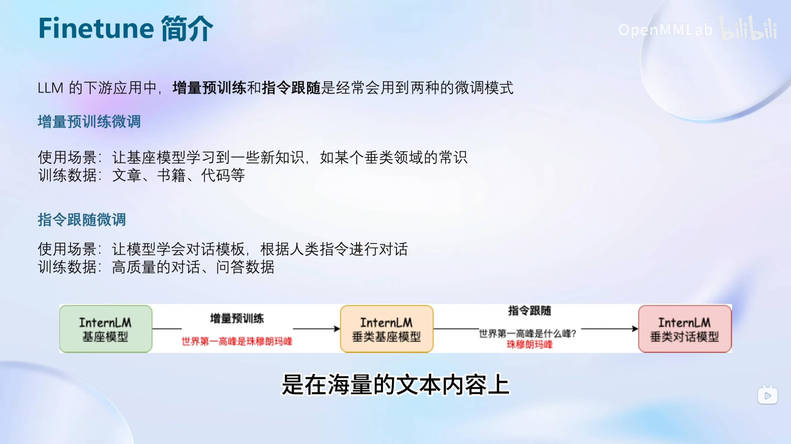


### 指令跟随微调

指令跟随需要指定角色，通常有3种：

- System
- User
- Assistant

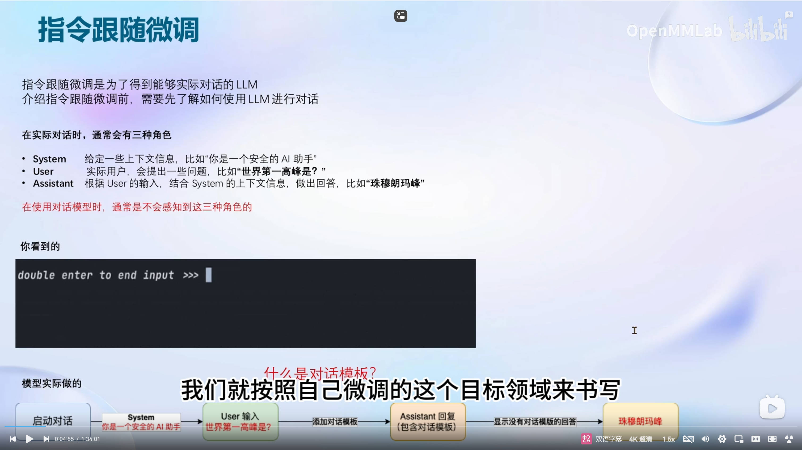


不同的模型对应的对话模板也会有差异：

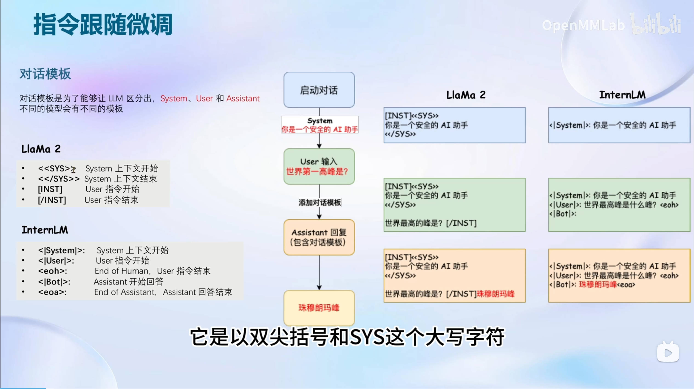


另外，需要注意的是，指令微调时，只需要计算回答部分（Assistant）的损失。

### 增量预训练

增量预训练不同于指令微调，他不需要问答式的数据进行微调，只需要回答即可。

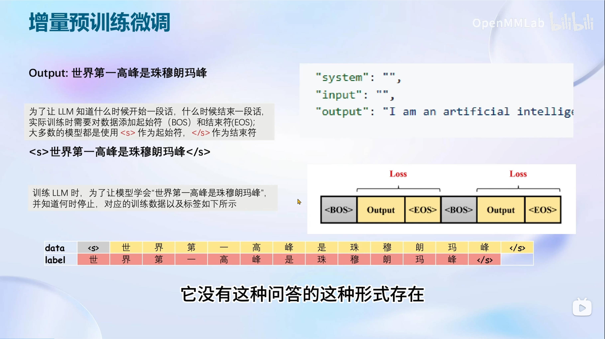


### LoRA

LoRA: Low-Rank Adaptation of Large Language Models。

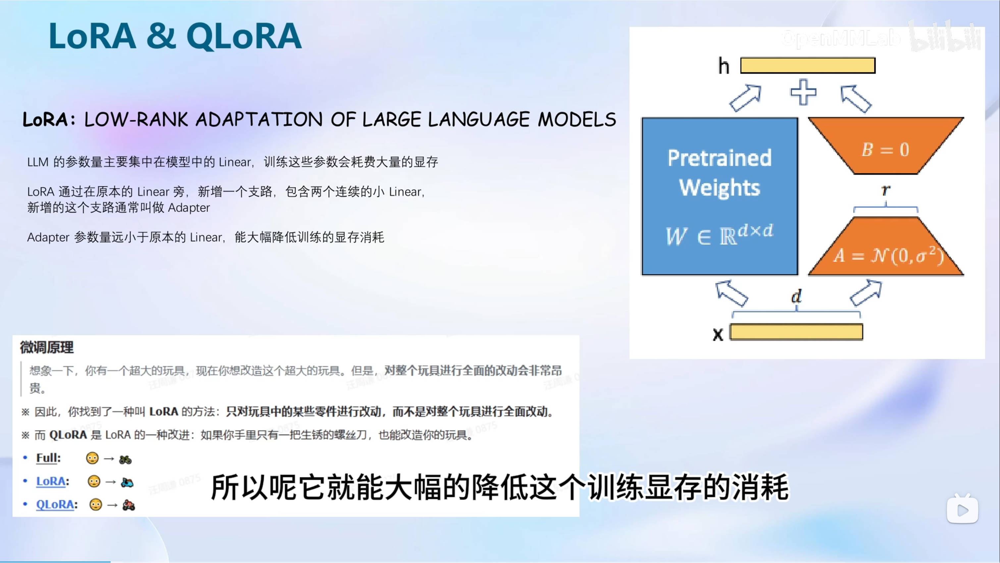

不同微调方法比较：

- Full finetuing: 完全微调，包括所有参数
- LoRA: BaseModel 只参与 forward，只有 Adapter 部分 backward 更新参数，只需要保存 Adapter 参数的优化器状态
- QLoRA：BaseModel 量化为 4-bit，优化器状态在 CPU 和 GPU 间 offload，只有 Adapter 部分 backward 更新参数，只需要保存 Adapter 参数的优化器状态

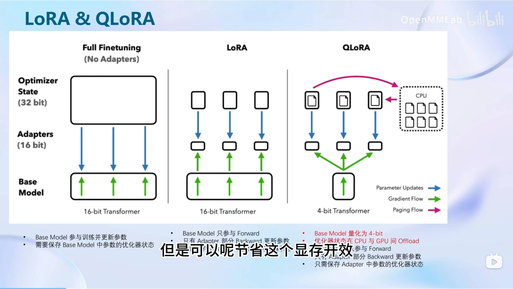

## XTuner 介绍

## 8 GB 显卡玩转 LLM

## 动手实践环节

### 环境准备

1. 新建 A100(1/4) 开发机

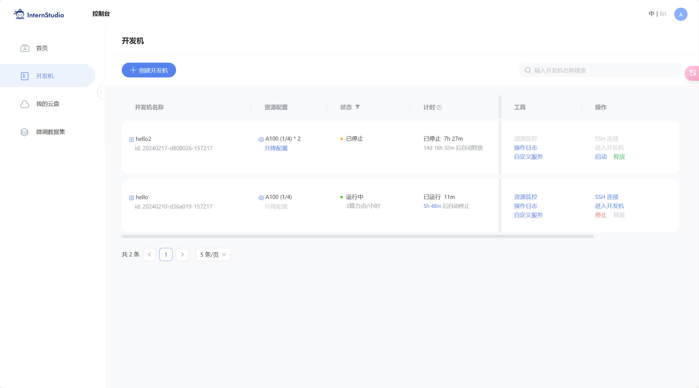

2. 配置 xtuner v0.1.9 环境

```
conda create -n xtuner0.1.9 --clone /root/share/conda_envs/internlm-base
conda activate xtuner0.1.9


# 进入家目录 （~的意思是 “当前用户的home路径”）
cd ~
# 创建版本文件夹并进入，以跟随本教程
mkdir xtuner019 && cd xtuner019


# 拉取 0.1.9 的版本源码
git clone -b v0.1.9  https://github.com/InternLM/xtuner
# 无法访问github的用户请从 gitee 拉取:
# git clone -b v0.1.9 https://gitee.com/Internlm/xtuner

# 进入源码目录
cd xtuner

# 从源码安装 XTuner
pip install -e '.[all]'
```

### 微调

1. 准备配置文件

```
mkdir ~/ft-oasst1 && cd ~/ft-oasst1
xtuner list-cfg
```

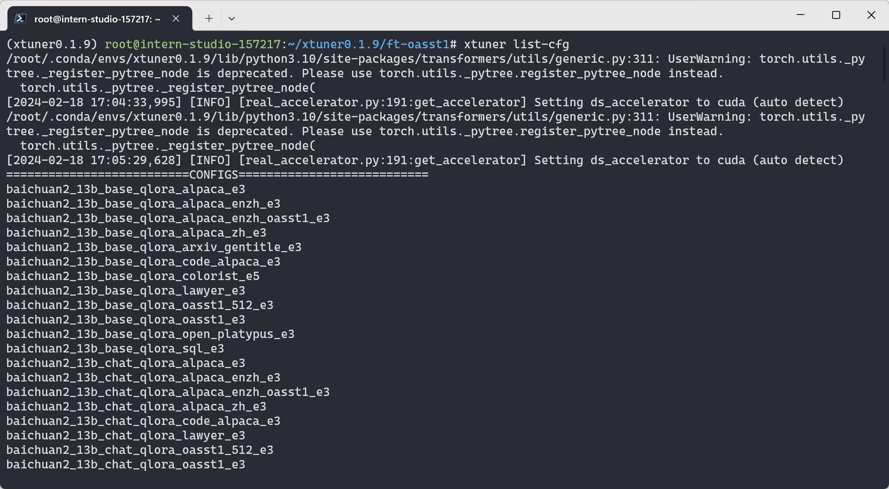

拷贝一个配置文件到当前目录：

```
xtuner copy-cfg internlm_chat_7b_qlora_oasst1_e3 .
```

2. 模型下载

模型较大，可直接采用平台自带的：

```
ln -s /share/temp/model_repos/internlm-chat-7b ~/ft-oasst1/
```

3. 数据集下载

[openassistant-guanaco](https://huggingface.co/datasets/timdettmers/openassistant-guanaco/tree/main)

可直接复制平台已有的：

```
cd ~/ft-oasst1
# ...-guanaco 后面有个空格和英文句号啊
cp -r /root/share/temp/datasets/openassistant-guanaco .
```

4. 微调

修改配置文件如下：

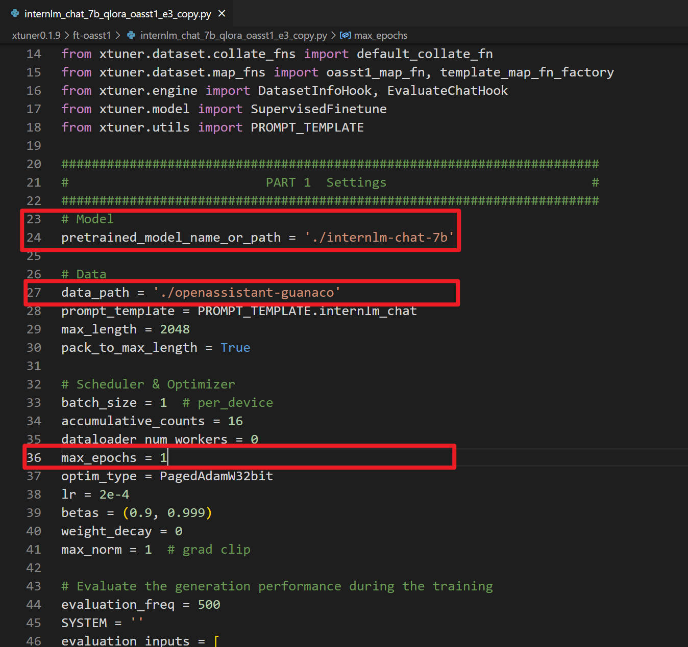

开始微调：

```
# 单卡
## 用刚才改好的config文件训练
xtuner train ./internlm_chat_7b_qlora_oasst1_e3_copy.py --deepspeed deepspeed_zero2

# 多卡
NPROC_PER_NODE=${GPU_NUM} xtuner train ./internlm_chat_7b_qlora_oasst1_e3_copy.py --deepspeed deepspeed_zero2

# 若要开启 deepspeed 加速，增加 --deepspeed deepspeed_zero2 即可
```

跑完训练后，当前路径如下：

```
|-- internlm-chat-7b
|-- internlm_chat_7b_qlora_oasst1_e3_copy.py
|-- openassistant-guanaco
|   |-- openassistant_best_replies_eval.jsonl
|   `-- openassistant_best_replies_train.jsonl
`-- work_dirs
    `-- internlm_chat_7b_qlora_oasst1_e3_copy
        |-- 20231101_152923
        |   |-- 20231101_152923.log
        |   `-- vis_data
        |       |-- 20231101_152923.json
        |       |-- config.py
        |       `-- scalars.json
        |-- epoch_1.pth
        |-- internlm_chat_7b_qlora_oasst1_e3_copy.py
        `-- last_checkpoint
```


5. 模型转换为HuggingFace模型，生成 Adapter 文件夹

```
mkdir hf
export MKL_SERVICE_FORCE_INTEL=1
export MKL_THREADING_LAYER=GNU
xtuner convert pth_to_hf ./internlm_chat_7b_qlora_oasst1_e3_copy.py ./work_dirs/internlm_chat_7b_qlora_oasst1_e3_copy/epoch_1.pth ./hf
```

生成的 hf 路径内容如下：

```
|-- hf
|   |-- README.md
|   |-- adapter_config.json
|   |-- adapter_model.bin
|   `-- xtuner_config.py
```

该文件夹即为平时所理解的 LoRA模型文件。

6. 部署于测试

首先将 huggingface adapter 合并到大语言模型:

```
xtuner convert merge ./internlm-chat-7b hf merged --max-shard-size 2GB
# xtuner convert merge \
#     ${NAME_OR_PATH_TO_LLM} \
#     ${NAME_OR_PATH_TO_ADAPTER} \
#     ${SAVE_PATH} \
#     --max-shard-size 2GB
```

然后就可以与合并后的模型对话了：

```
# 加载 Adapter 模型对话（Float 16）
xtuner chat ./merged --prompt-template internlm_chat

# 4 bit 量化加载
# xtuner chat ./merged --bits 4 --prompt-template internlm_chat
```

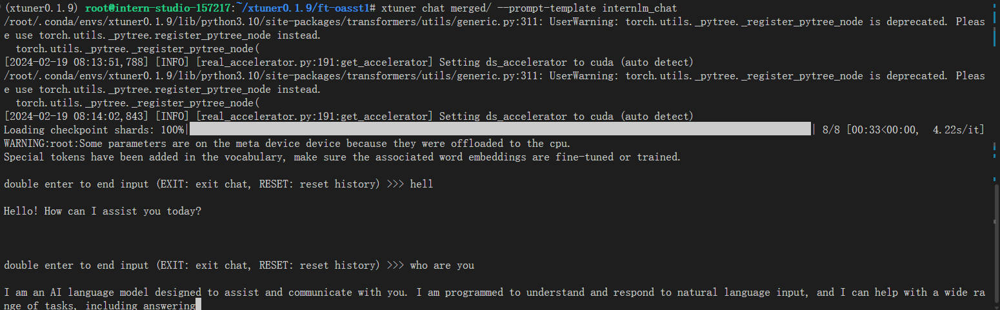

### 自定义微调

以 Medication QA 数据集为例，基于 InternLM-chat-7B 模型，将其往医学问答领域对齐。

1. 数据集准备

```
mkdir ft-medqa && cd ft-medqa
wget https://github.com/abachaa/Medication_QA_MedInfo2019/blob/master/MedInfo2019-QA-Medications.xlsx -o MedQA2019.xlsx
```

通过 python 脚本：将 .xlsx 中的 问题 和 回答 两列 提取出来，再放入 .jsonL 文件的每个 conversation 的 input 和 output 中。

>这一步可以使用如下 prompt，利用ChatGPT来完成数据转换的脚本编写：

```
Write a python file for me. using openpyxl. input file name is MedQA2019.xlsx
Step1: The input file is .xlsx. Exact the column A and column D in the sheet named "DrugQA" .
Step2: Put each value in column A into each "input" of each "conversation". Put each value in column D into each "output" of each "conversation".
Step3: The output file is .jsonL. It looks like:
[{
    "conversation":[
        {
            "system": "xxx",
            "input": "xxx",
            "output": "xxx"
        }
    ]
},
{
    "conversation":[
        {
            "system": "xxx",
            "input": "xxx",
            "output": "xxx"
        }
    ]
}]
Step4: All "system" value changes to "You are a professional, highly experienced doctor professor. You always provide accurate, comprehensive, and detailed answers based on the patients' questions."
```

安装 `openpyxl` 库：

```
pip install openpyxl
``` 

执行 `xlsx2jsonl.py` 完成数据转换。


然后还是利用 ChatGPT 来划分训练集和测试集：

```
my .jsonL file looks like:
[{
    "conversation":[
        {
            "system": "xxx",
            "input": "xxx",
            "output": "xxx"
        }
    ]
},
{
    "conversation":[
        {
            "system": "xxx",
            "input": "xxx",
            "output": "xxx"
        }
    ]
}]
Step1, read the .jsonL file.
Step2, count the amount of the "conversation" elements.
Step3, randomly split all "conversation" elements by 7:3. Targeted structure is same as the input.
Step4, save the 7/10 part as train.jsonl. save the 3/10 part as test.jsonl
```

生成 `split2train_and_test.py` 脚本。执行后，生成 `MedQA2019-structured-train.jsonl` 和 `MedQA2019-structured-test.jsonl` 文件。


2. 模型下载

同前面微调一样，直接将平台上已有的模型软链接过来即可

```
ln -s /share/temp/model_repos/internlm-chat-7b .
```

3. 准备配置文件

```
# 复制配置文件到当前目录
xtuner copy-cfg internlm_chat_7b_qlora_oasst1_e3 .
# 改个文件名
mv internlm_chat_7b_qlora_oasst1_e3_copy.py internlm_chat_7b_qlora_medqa2019_e3.py
```

修改配置文件内容如下：

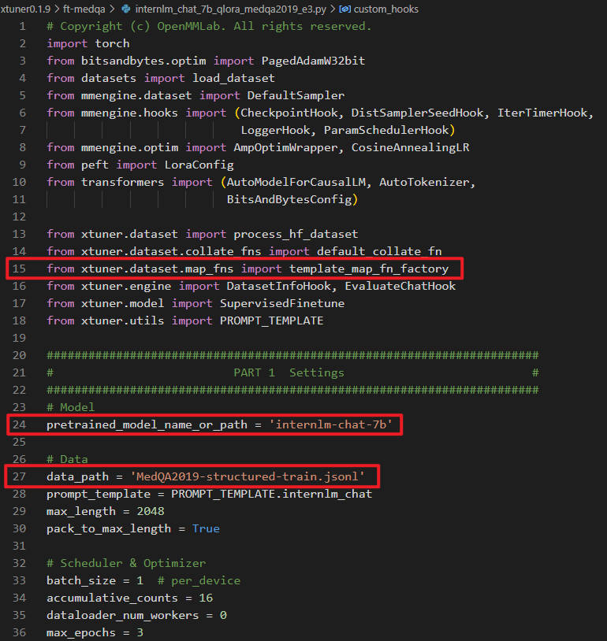
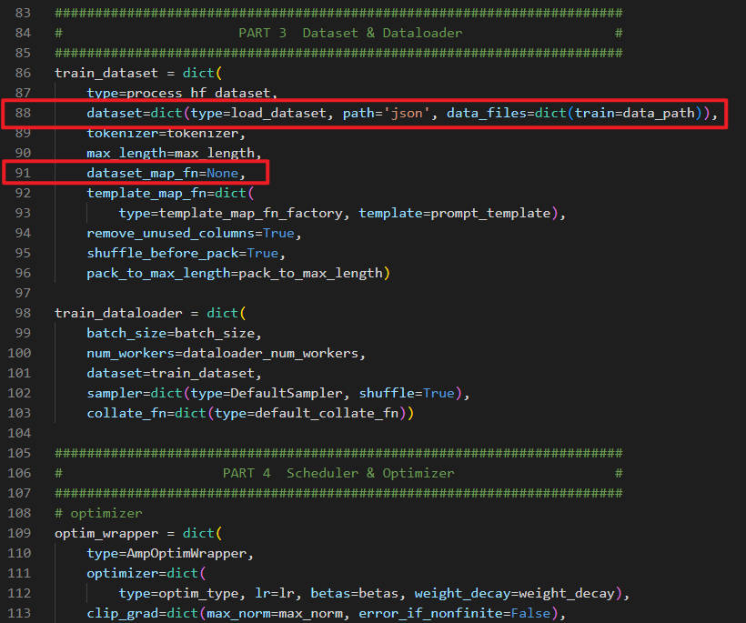

4. 开始微调

```
xtuner train internlm_chat_7b_qlora_medqa2019_e3.py --deepspeed deepspeed_zero2
```

5. 模型转换测试

```
mkdir hf
# 转换为hf模型
xtuner convert pth_to_hf ./internlm_chat_7b_qlora_medqa2019_e3.py ./work_dirs/internlm_chat_7b_qlora_medqa2019_e3/epoch_3.pth ./hf

# 合并到大语言模型
xtuner convert merge ./internlm-chat-7b hf merged --max-shard-size 2GB

# 合并后模型对话
xtuner chat ./merged --prompt-template internlm_chat --bits 4
```

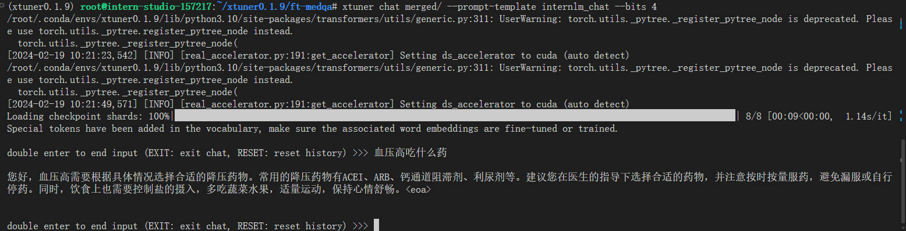

模型微调前后对比：

| 微调前                                  | 微调后                                  |
| --------------------------------------- | --------------------------------------- |
| 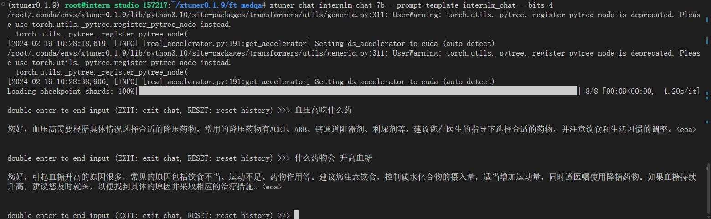 | 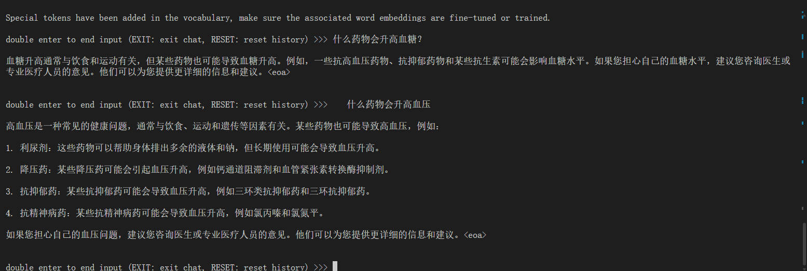 |

