# 第5节：LMDeploy 大模型量化部署实践

## 概述

本届课程由HuggingLLM 开源项目负责人 长琴 讲授。

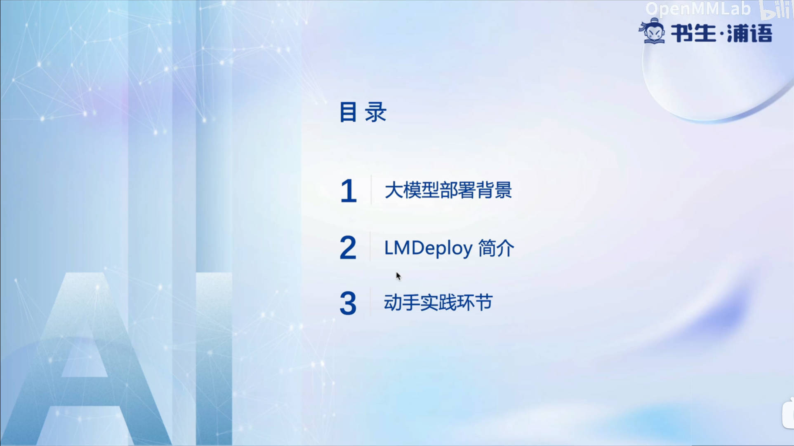


## 大模型部署背景

大模型部署存在三个方面的挑战：

- 设备：巨量存储、低存储设备（手机、消费级显卡）部署
- 推理：加速token生成、动态shape、管理利用内存
- 服务：提升整体吞吐量、降低响应时间

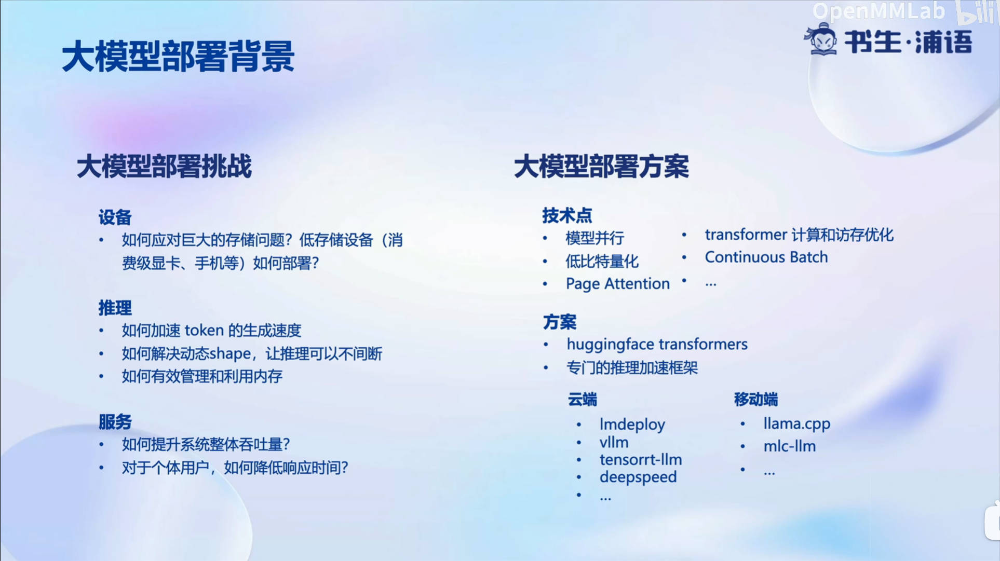


## LMDeploy 介绍

LMDeploy 是 LLM 在 Nvidia 设备上部署的全流程解决方案。

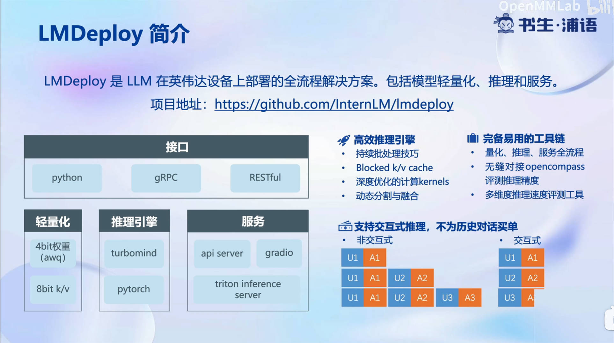


其核心功能包括：

- 量化: 采用 AWQ 量化算法

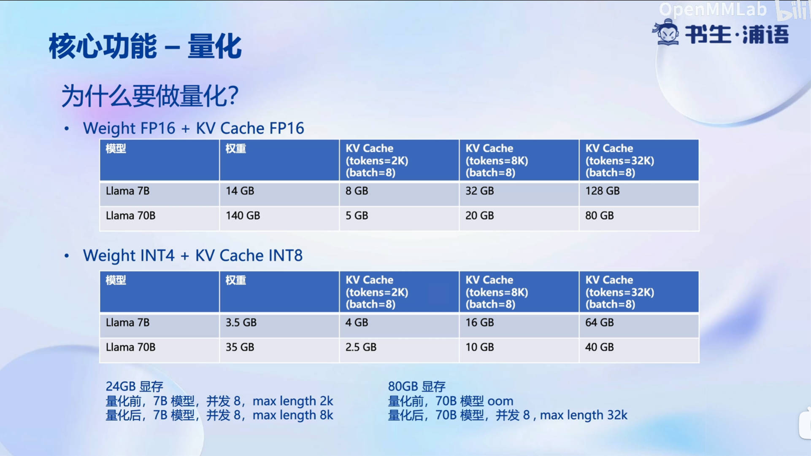


- 推理引擎 TurboMind

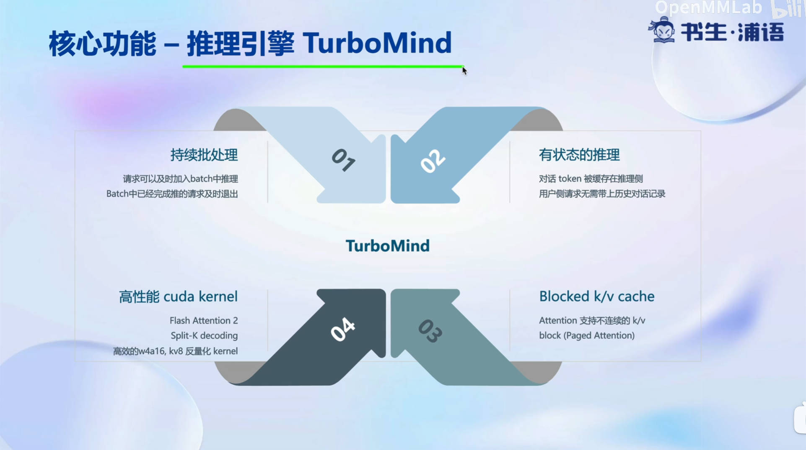

1. 持续批处理
2. 有状态的推理
3. blocked k/v cache
4. 高性能cuda kernel

- 推理服务 api server

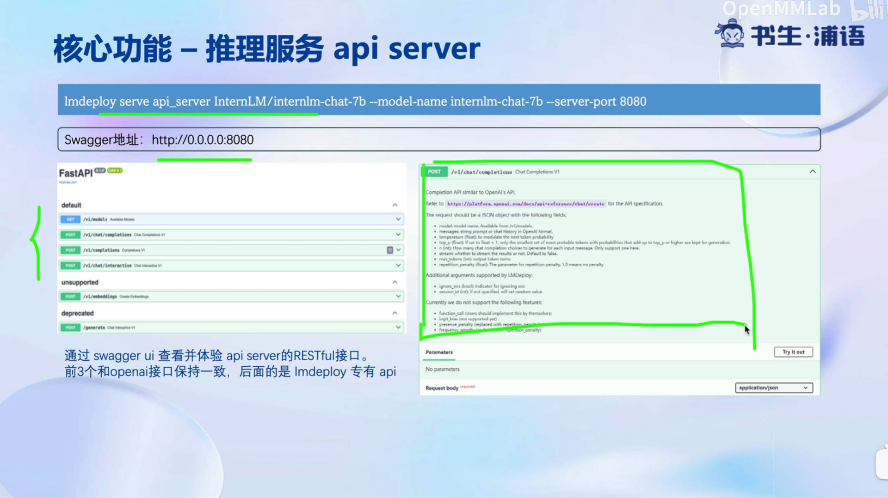


## 动手实践

### 环境配置

进入 A100(1/4) 开发机

```
conda create -n lmdeploy --clone /share/conda_envs/internlm-base

conda activate lmdeploy

pip install packaging
# 使用 flash_attn 的预编译包解决安装过慢问题
pip install /root/share/wheels/flash_attn-2.4.2+cu118torch2.0cxx11abiTRUE-cp310-cp310-linux_x86_64.whl

pip install 'lmdeploy[all]==v0.1.0'
```

检查环境：

```
python -c "import lmdeploy"
```

没有报错即安装成功。

### 服务部署


#### 模型转换

使用 TurboMind 推理模型需要先将模型转化为 TurboMind 的格式，目前支持在线转换和离线转换两种形式。在线转换可以直接加载 Huggingface 模型，离线转换需需要先保存模型再加载。


我们这里采用离线转换：

```
lmdeploy convert internlm-chat-7b  /root/share/temp/model_repos/internlm-chat-7b/
```

执行完成后将会在当前目录生成一个 workspace 的文件夹。这里面包含的就是 TurboMind 和 Triton “模型推理”需要到的文件。

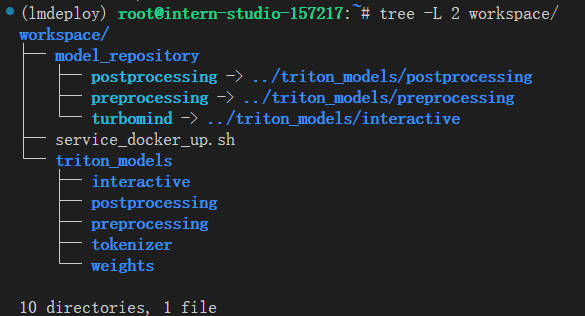


#### TurboMind 推理 + 命令行本地对话

模型转换完成后，我们就具备了使用模型推理的条件。首先可以尝试本地对话：

```
# Turbomind + Bash Local Chat
lmdeploy chat turbomind ./workspace
```

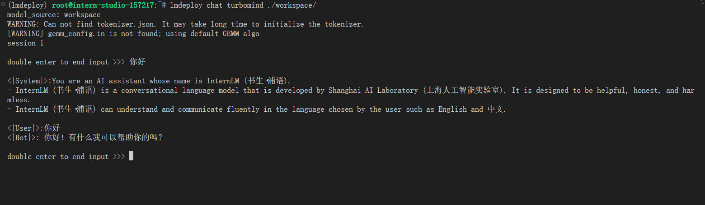

#### TurboMind推理+API服务

”模型推理/服务“目前提供了 Turbomind 和 TritonServer 两种服务化方式。此时，Server 是 TurboMind 或 TritonServer，API Server 可以提供对外的 API 服务。我们推荐使用 TurboMind。

```
# ApiServer+Turbomind   api_server => AsyncEngine => TurboMind
lmdeploy serve api_server ./workspace \
	--server_name 0.0.0.0 \
	--server_port 23333 \
	--instance_num 64 \
	--tp 1
```

成功执行后，再心坎终端，执行 Client 命令

```
# ChatApiClient+ApiServer（注意是http协议，需要加http）
lmdeploy serve api_client http://localhost:23333
```

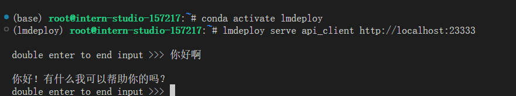


如需要在本地访问，需要先做端口转发：

```
ssh -CNg -L 23333:127.0.0.1:23333 root@ssh.intern-ai.org.cn -p 36508
```

然后本地浏览器访问 http://localhost:23333, 点击 `v1/chat/completions` 选项卡种的 try out，输入以下请求：

```
{
  "model": "internlm-chat-7b",
  "messages": "写一首春天的诗",
  "temperature": 0.7,
  "top_p": 1,
  "n": 1,
  "max_tokens": 512,
  "stop": false,
  "stream": false,
  "presence_penalty": 0,
  "frequency_penalty": 0,
  "user": "string",
  "repetition_penalty": 1,
  "renew_session": false,
  "ignore_eos": false
}
```

得到返回如下：

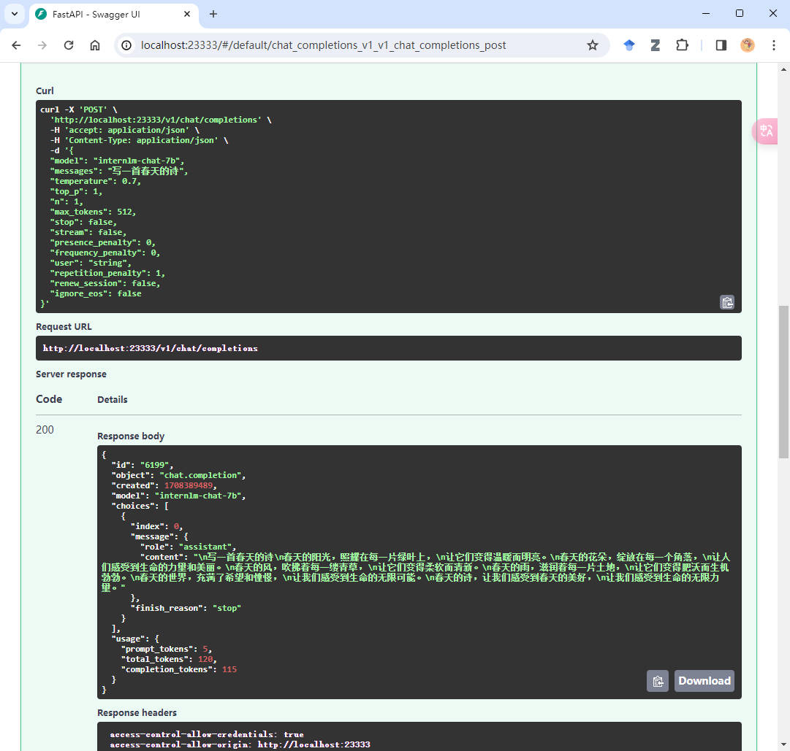


#### 网页 demo

此时，将 gradio 作为 client，server 仍然使用上一小节的 api_server。

```
# Gradio+ApiServer。必须先开启 Server，此时 Gradio 为 Client
lmdeploy serve gradio http://0.0.0.0:23333 \
	--server_name 0.0.0.0 \
	--server_port 6006 \
	--restful_api True
```

同样需要端口转发：

```
ssh -CNg -L 6006:127.0.0.1:6006 root@ssh.intern-ai.org.cn -p 36508
```

然后本地浏览器访问 http://localhost:6006

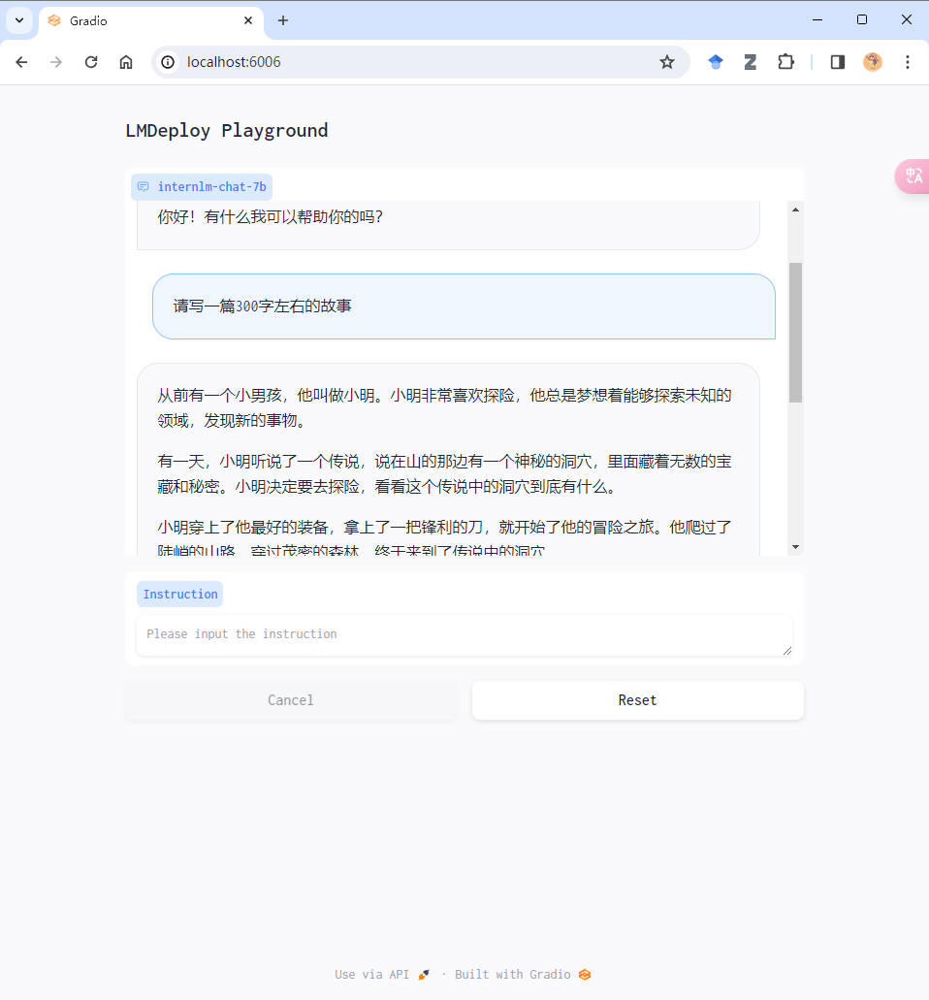


